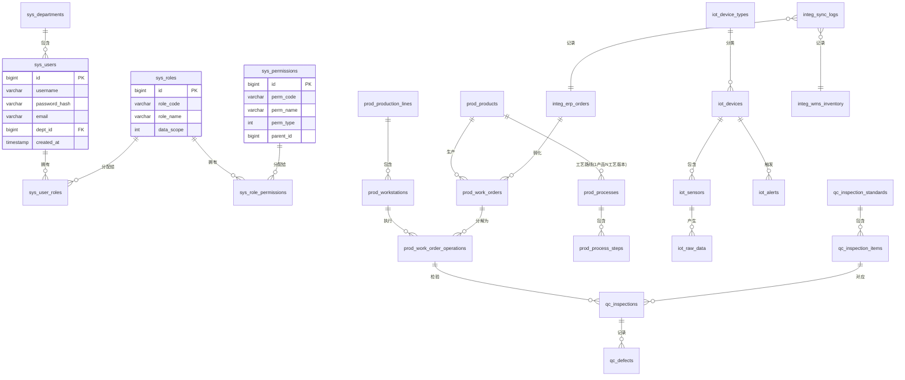
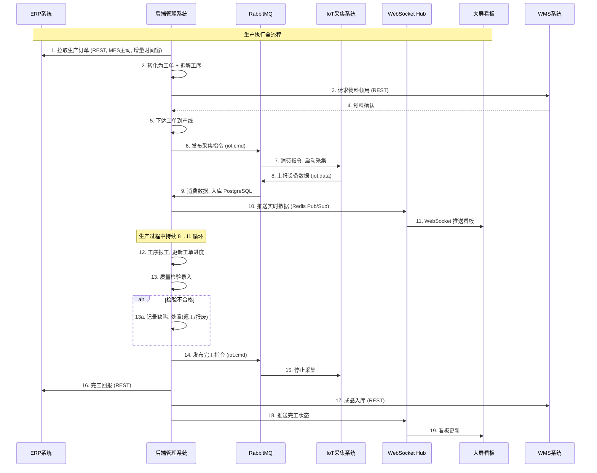
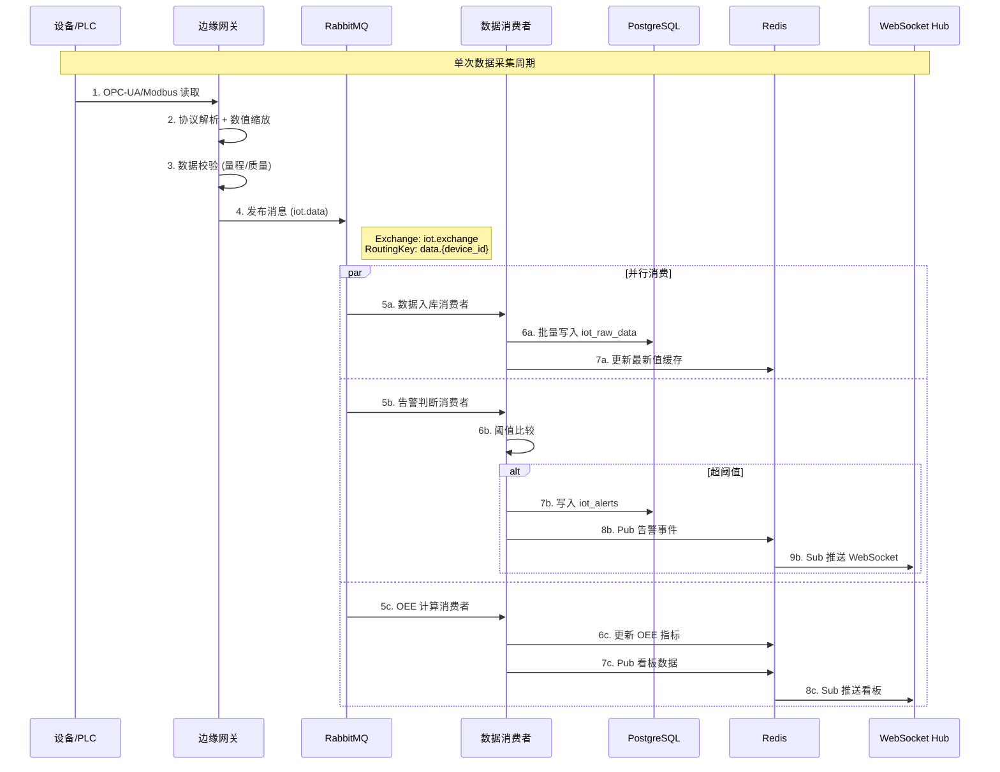
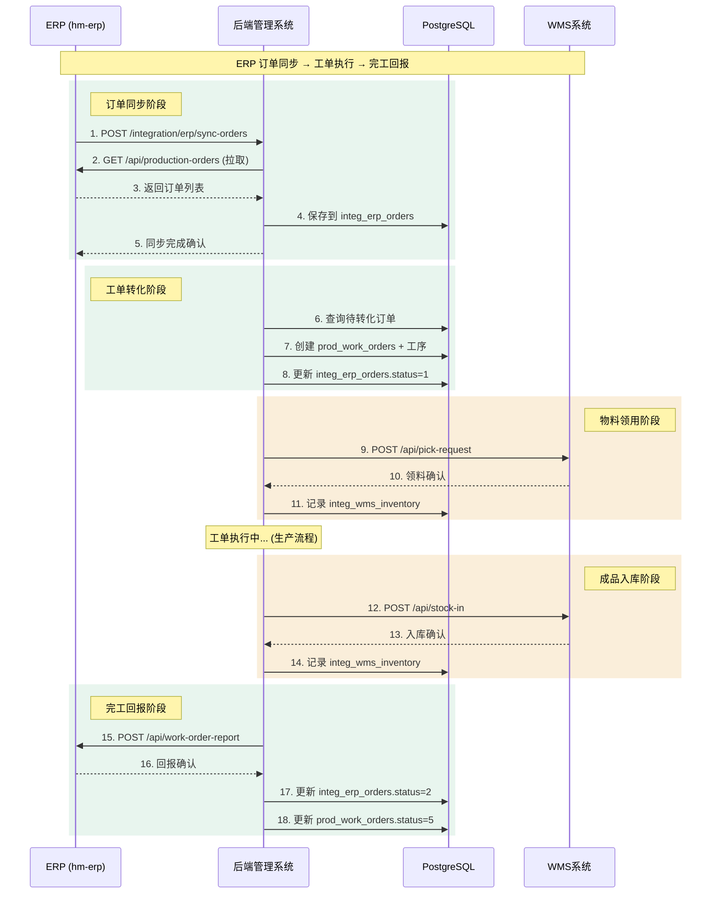

# MES 制造执行系统 — 完整架构设计文档

> 版本: 1.0 | 日期: 2026-08-09 | 技术栈: C++ Drogon + React/Vue3 + PostgreSQL + Redis + RabbitMQ

---

## 目录

1. [系统概述](#1-系统概述)
2. [系统架构设计](#2-系统架构设计)
3. [数据库表设计](#3-数据库表设计)
4. [RESTful API 接口定义](#4-restful-api-接口定义)
5. [用户权限控制方案](#5-用户权限控制方案)
6. [业务逻辑关系](#6-业务逻辑关系)
7. [高并发与数据一致性策略](#7-高并发与数据一致性策略)

---

## 1. 系统概述

### 1.1 设计目标

MES (Human Manufacturing System) 是面向制造业的执行系统，核心设计目标：

| 目标 | 描述 |
|------|------|
| **三系统独立** | 后端管理、大屏看板、IoT 数据采集三个子系统独立部署、独立扩展 |
| **MQ 解耦** | IoT 采集与后端通过 RabbitMQ 通讯，采集端故障不影响后端 |
| **外部集成** | 支持 ERP (hm-erp)、WMS 系统双向对接 |
| **高并发** | 支撑万级设备并发采集、千级看板并发连接 |
| **数据安全** | 事务一致性保证、操作审计追溯、RBAC 细粒度权限 |

### 1.2 技术栈

| 层级 | 技术选型 | 说明 |
|------|---------|------|
| 后端框架 | C++ Drogon | 高性能异步 Web 框架，支持 HTTP/WebSocket |
| 前端管理后台 | React 18 + Vite + Ant Design 5 | 组件丰富、生态成熟 |
| 前端大屏看板 | Vue3 + ECharts 5 + WebSocket | 实时数据可视化、动画流畅 |
| 数据库 | PostgreSQL 16 | 强事务、JSONB 支持、分区表 |
| 缓存 | Redis 7 (Cluster) | 会话、缓存、Pub/Sub 看板推送 |
| 消息队列 | RabbitMQ 3.13 (Cluster) | AMQP 协议、可靠投递、死信队列 |
| IoT 协议 | OPC-UA / Modbus TCP / MQTT | 工业标准协议覆盖 |
| 容器化 | Docker + Docker Compose | 一键部署、水平扩展 |

### 1.3 三大独立子系统

```
┌─────────────────────────────────────────────────────────────────┐
│                    MES 系统边界                                    │
│                                                                   │
│  ┌──────────────┐    AMQP    ┌──────────────┐   WebSocket       │
│  │  ① IoT 数据  │──────────▶│  ② 后端管理   │◀──────────────▶  │
│  │    采集系统   │  RabbitMQ │    系统        │                  │
│  │  (独立部署)   │◀──────────│  (Drogon C++)  │  ┌────────────┐  │
│  └──────────────┘           └──────┬───────┘  │ ③ 大屏看板  │  │
│                                    │ REST     │   (独立部署) │  │
│                          ┌─────────┴────────┐ └────────────┘  │
│                          │  ERP / WMS 集成   │                  │
│                          └──────────────────┘                  │
└─────────────────────────────────────────────────────────────────┘
```

**独立部署优势**：
- ① IoT 采集系统宕机 → 后端仍可服务历史数据，看板降级展示
- ② 后端维护升级 → IoT 采集继续运行，消息堆积在 RabbitMQ，恢复后自动消费
- ③ 大屏看板独立 → 可部署在独立 GPU 服务器，不占用后端资源

---

## 2. 系统架构设计

### 2.1 整体架构层次

```
┌──────────────────────────────────────────────────────────────┐
│                     客户端层 (Client Layer)                     │
│  ┌──────────────────┐        ┌──────────────────┐             │
│  │  Web 管理后台     │        │  大屏看板系统     │             │
│  │  React + AntD    │        │  Vue3 + ECharts  │             │
│  │  HTTP / REST     │        │  WebSocket 实时   │             │
│  └────────┬─────────┘        └────────┬─────────┘             │
└───────────┼──────────────────────────┼──────────────────────┘
            │ HTTP/HTTPS              │ WebSocket (WSS)
            │                          │
┌───────────▼──────────────────────────▼──────────────────────┐
│                 外部系统集成层 (Integration Layer)              │
│  ┌──────────────┐              ┌──────────────┐            │
│  │  ERP hm-erp  │              │  WMS 系统     │            │
│  │  REST API    │              │  REST API    │            │
│  └──────┬───────┘              └──────┬───────┘            │
└─────────┼──────────────────────────────┼───────────────────┘
          │ REST API                    │ REST API
          │                              │
┌─────────▼──────────────────────────────▼───────────────────┐
│              后端管理系统 (Backend Layer)                      │
│                                                               │
│  ┌─────────────────────────────────────────────────────────┐  │
│  │              API Gateway (Drogon C++)                    │  │
│  │   HTTP 路由 · WebSocket Hub · JWT 中间件 · 限流中间件     │  │
│  └───────────────────────┬─────────────────────────────────┘  │
│                           │                                   │
│  ┌──────────┐  ┌──────────┴─────────┐  ┌──────────┐         │
│  │ 权限管理  │  │    业务服务层        │  │ 集成服务  │         │
│  │ RBAC     │  │  生产/质量/设备      │  │ ERP/WMS  │         │
│  └──────────┘  └──────────┬─────────┘  └──────────┘         │
│                           │                                   │
│  ┌────────────────────────▼────────────────────────────────┐  │
│  │                    数据访问层                             │  │
│  │  ┌──────────────┐  ┌──────────┐  ┌─────────────────┐   │  │
│  │  │ PostgreSQL    │  │  Redis   │  │  RabbitMQ       │   │  │
│  │  │ 连接池 (ORM)   │  │  Cluster │  │  Producer/Cons. │   │  │
│  │  └──────────────┘  └──────────┘  └────────┬────────┘   │  │
│  └─────────────────────────────────────────────┼───────────┘  │
└─────────────────────────────────────────────────┼──────────────┘
                                                   │ AMQP
┌──────────────────────────────────────────────────▼─────────────┐
│              RabbitMQ 消息中间件 (Message Layer)                 │
│                                                                   │
│  Exchange: iot.exchange (topic)                                  │
│    ├── Queue: iot.data.queue     → 消费者: 数据入库服务           │
│    ├── Queue: iot.alert.queue     → 消费者: 告警处理服务           │
│    ├── Queue: iot.cmd.queue      → 消费者: 指令下发服务           │
│    └── Queue: iot.dlq.queue      → 死信队列 (消费失败)           │
│                                                                   │
│  Exchange: dashboard.exchange (fanout)                           │
│    └── Queue: dashboard.push.queue → 消费者: WebSocket 推送服务   │
└──────────────────────────────────────────────────┬──────────────┘
                                                   │ AMQP
┌──────────────────────────────────────────────────▼─────────────┐
│              IoT 数据采集系统 (IoT Layer)                         │
│                                                                     │
│  ┌──────────┐  ┌──────────┐  ┌──────────┐  ┌──────────┐        │
│  │ 边缘网关  │  │ PLC 采集  │  │传感器/RFID│  │ MQTT 网桥│        │
│  │ Edge GW  │  │ OPC-UA   │  │ IoT Dev  │  │MQTT→AMQP │        │
│  └──────────┘  └──────────┘  └──────────┘  └──────────┘        │
└─────────────────────────────────────────────────────────────────┘
```

> **队列声明要求**: `iot.data.queue` / `iot.alert.queue` / `iot.cmd.queue` 声明时必须携带死信参数 `x-dead-letter-exchange=iot.dlx.exchange`、`x-dead-letter-routing-key=dlq`，由 `iot.dlx.exchange` 路由到 `iot.dlq.queue`；另需声明带 `x-message-ttl` 的延迟重试队列 `iot.retry.queue`（其 DLX 指回 `iot.exchange`），实现有退避的有界重试。

### 2.2 通信协议矩阵

| 源 → 目标 | 协议 | 端口 | 数据格式 | 说明 |
|-----------|------|------|---------|------|
| Web 前端 → 后端 | HTTP/HTTPS REST | 443 | JSON | 标准 RESTful 请求 |
| 大屏看板 → 后端 | WebSocket (WSS) | 443 | JSON | 双向实时推送 |
| 后端 → ERP | HTTP REST | 8090 | JSON | 生产订单同步、工单回报 |
| 后端 → WMS | HTTP REST | 8091 | JSON | 物料领用、成品入库 |
| IoT 采集 → RabbitMQ | AMQP | 5672 | JSON (见 2.4 消息契约) | 设备数据上报 |
| 后端 → RabbitMQ | AMQP | 5672 | JSON | 指令下发、消费数据 |
| 后端 → Redis | RESP | 6379 | Binary | 缓存读写、Pub/Sub |
| 后端 → PostgreSQL | TCP | 5432 | Binary | 数据持久化 |

### 2.3 Drogon 后端项目结构

```
mes-backend/
├── CMakeLists.txt
├── config/
│   ├── drogon_config.json          # Drogon 框架配置
│   ├── database.json               # 数据库连接配置
│   ├── redis.json                  # Redis 配置
│   └── rabbitmq.json               # RabbitMQ 配置
├── src/
│   ├── main.cc                     # 程序入口
│   ├── config/
│   │   └── ConfigLoader.hh         # 配置加载器
│   ├── controllers/                # 控制器层 (HTTP 路由)
│   │   ├── AuthController.hh       # 认证接口
│   │   ├── UserController.hh       # 用户管理
│   │   ├── RoleController.hh       # 角色管理
│   │   ├── WorkOrderController.hh  # 工单管理
│   │   ├── DeviceController.hh     # 设备管理
│   │   ├── QualityController.hh    # 质量管理
│   │   ├── DashboardController.hh  # 看板接口
│   │   ├── ErpController.hh        # ERP 集成
│   │   └── WmsController.hh        # WMS 集成
│   ├── services/                   # 业务服务层
│   │   ├── AuthService.hh          # 认证逻辑
│   │   ├── RbacService.hh          # RBAC 权限
│   │   ├── WorkOrderService.hh     # 工单业务
│   │   ├── DeviceService.hh        # 设备业务
│   │   ├── QualityService.hh       # 质量业务
│   │   ├── IntegrationService.hh   # ERP/WMS 集成
│   │   └── DashboardService.hh     # 看板数据聚合
│   ├── models/                     # 数据模型层 (ORM)
│   │   ├── BaseModel.hh            # 基类
│   │   ├── User.hh                 # 用户模型
│   │   ├── Role.hh                 # 角色模型
│   │   ├── WorkOrder.hh            # 工单模型
│   │   ├── Device.hh               # 设备模型
│   │   └── ...                     # 其他模型
│   ├── mq/                         # RabbitMQ 模块
│   │   ├── MqProducer.hh           # 消息生产者
│   │   ├── MqConsumer.hh           # 消息消费者
│   │   ├── DataIngestHandler.hh    # 数据入库处理器
│   │   ├── AlertHandler.hh         # 告警处理器
│   │   └── CmdDispatchHandler.hh   # 指令下发处理器
│   ├── websocket/                  # WebSocket 模块
│   │   ├── WsServer.hh             # WebSocket 服务端
│   │   ├── WsConnection.hh         # 连接管理
│   │   └── WsBroadcastManager.hh   # 广播管理器
│   ├── middlewares/                # 中间件
│   │   ├── JwtMiddleware.hh        # JWT 鉴权中间件
│   │   ├── RbacMiddleware.hh       # RBAC 权限检查
│   │   ├── RateLimitMiddleware.hh  # 限流中间件
│   │   └── AuditMiddleware.hh      # 操作审计
│   ├── utils/                      # 工具类
│   │   ├── JwtUtils.hh             # JWT 工具
│   │   ├── CryptoUtils.hh          # 加密工具
│   │   ├── TimeUtils.hh            # 时间工具
│   │   └── ResponseBuilder.hh      # 统一响应构造
│   └── plugins/                    # Drogon 插件
│       ├── DbClientPlugin.hh       # 数据库客户端插件
│       ├── RedisClientPlugin.hh    # Redis 客户端插件
│       └── MqClientPlugin.hh       # RabbitMQ 客户端插件
├── migrations/                     # 数据库迁移脚本
│   ├── 001_init_schema.sql
│   ├── 002_seed_data.sql
│   └── ...
└── tests/                          # 单元测试
```

### 2.4 IoT 数据上报消息契约 (MQ Schema)

IoT 采集系统发布到 `iot.exchange` 的数据上报消息统一采用如下 JSON Schema（content-type 固定为 `application/json`），所有生产者与消费者必须遵守；schema 演进通过 `version` 字段保持向后兼容：

| 字段 | 类型 | 必填 | 说明 |
|------|------|------|------|
| version | string | 是 | 消息 schema 版本, 当前 "1.0" |
| device_id | bigint | 是 | 设备ID (iot_devices.id) |
| device_code | string | 是 | 设备编码 |
| sensor_id | bigint | 是 | 传感器/点位ID (iot_sensors.id) |
| value | number | 是 | 采集数值 |
| quality | int | 是 | OPC-UA 质量码 (192=Good) |
| ts | string | 是 | 采集时间, UTC ISO 8601 带 Z |
| task_id | bigint | 否 | 触发采集的任务ID |

```json
{
    "version": "1.0",
    "device_id": 10,
    "device_code": "CNC-001",
    "sensor_id": 42,
    "value": 36.5,
    "quality": 192,
    "ts": "2026-08-09T12:36:51Z",
    "task_id": 3
}
```

**兼容性规则**: 只增不删字段；消费者必须忽略未知字段；破坏性变更需升级 `version` 并双版本并行过渡。

---

## 3. 数据库表设计

### 3.1 ER 关系图



### 3.2 用户权限模块

#### 3.2.1 sys_departments — 部门表

```sql
CREATE TABLE sys_departments (
    id              BIGSERIAL PRIMARY KEY,
    parent_id       BIGINT REFERENCES sys_departments(id) DEFAULT NULL,  -- NULL 表示顶级部门
    dept_code       VARCHAR(64) NOT NULL UNIQUE,
    dept_name       VARCHAR(128) NOT NULL,
    sort_order      INT DEFAULT 0,
    leader_id       BIGINT,
    phone           VARCHAR(20),
    status          SMALLINT DEFAULT 1,  -- 0:禁用 1:启用
    deleted         BOOLEAN DEFAULT FALSE,
    created_at      TIMESTAMPTZ DEFAULT NOW(),
    updated_at      TIMESTAMPTZ DEFAULT NOW()
);
CREATE INDEX idx_dept_parent ON sys_departments(parent_id);
```

#### 3.2.2 sys_users — 用户表

```sql
CREATE TABLE sys_users (
    id              BIGSERIAL PRIMARY KEY,
    dept_id         BIGINT REFERENCES sys_departments(id),
    username        VARCHAR(64) NOT NULL UNIQUE,
    password_hash   VARCHAR(256) NOT NULL,
    real_name       VARCHAR(64) NOT NULL,
    employee_no     VARCHAR(32) UNIQUE,
    email           VARCHAR(128),
    phone           VARCHAR(20),
    avatar_url      VARCHAR(512),
    gender          SMALLINT DEFAULT 0,  -- 0:未知 1:男 2:女
    status          SMALLINT DEFAULT 1,  -- 0:禁用 1:启用 2:锁定
    last_login_at   TIMESTAMPTZ,
    last_login_ip   INET,
    login_fail_count INT DEFAULT 0,
    password_changed_at TIMESTAMPTZ DEFAULT NOW(),
    deleted         BOOLEAN DEFAULT FALSE,
    created_at      TIMESTAMPTZ DEFAULT NOW(),
    updated_at      TIMESTAMPTZ DEFAULT NOW()
);
CREATE INDEX idx_user_dept ON sys_users(dept_id);
CREATE INDEX idx_user_status ON sys_users(status) WHERE deleted = FALSE;
```

#### 3.2.3 sys_roles — 角色表

```sql
CREATE TABLE sys_roles (
    id              BIGSERIAL PRIMARY KEY,
    role_code       VARCHAR(64) NOT NULL UNIQUE,
    role_name       VARCHAR(128) NOT NULL,
    description     TEXT,
    data_scope      SMALLINT DEFAULT 1,
    -- 1:仅本人 2:本部门 3:本部门及子部门 4:全部 5:自定义
    sort_order      INT DEFAULT 0,
    status          SMALLINT DEFAULT 1,
    deleted         BOOLEAN DEFAULT FALSE,
    created_at      TIMESTAMPTZ DEFAULT NOW(),
    updated_at      TIMESTAMPTZ DEFAULT NOW()
);
```

#### 3.2.4 sys_permissions — 权限表

```sql
CREATE TABLE sys_permissions (
    id              BIGSERIAL PRIMARY KEY,
    parent_id       BIGINT REFERENCES sys_permissions(id) DEFAULT NULL,  -- NULL 表示根权限
    perm_code       VARCHAR(128) NOT NULL UNIQUE,
    perm_name       VARCHAR(128) NOT NULL,
    perm_type       SMALLINT NOT NULL,  -- 1:菜单 2:按钮 3:接口
    path            VARCHAR(256),       -- 菜单路由或接口路径
    method          VARCHAR(10),        -- 接口类型 (GET/POST/PUT/DELETE)
    icon            VARCHAR(64),
    sort_order      INT DEFAULT 0,
    visible         BOOLEAN DEFAULT TRUE,
    status          SMALLINT DEFAULT 1,
    created_at      TIMESTAMPTZ DEFAULT NOW(),
    updated_at      TIMESTAMPTZ DEFAULT NOW()
);
CREATE INDEX idx_perm_parent ON sys_permissions(parent_id);
CREATE INDEX idx_perm_type ON sys_permissions(perm_type);
CREATE INDEX idx_perm_code ON sys_permissions(perm_code);
```

#### 3.2.5 sys_user_roles — 用户角色关联

```sql
CREATE TABLE sys_user_roles (
    id              BIGSERIAL PRIMARY KEY,
    user_id         BIGINT NOT NULL REFERENCES sys_users(id) ON DELETE CASCADE,
    role_id         BIGINT NOT NULL REFERENCES sys_roles(id) ON DELETE CASCADE,
    created_at      TIMESTAMPTZ DEFAULT NOW(),
    UNIQUE(user_id, role_id)
);
CREATE INDEX idx_user_roles_user ON sys_user_roles(user_id);
CREATE INDEX idx_user_roles_role ON sys_user_roles(role_id);
```

#### 3.2.6 sys_role_permissions — 角色权限关联

```sql
CREATE TABLE sys_role_permissions (
    id              BIGSERIAL PRIMARY KEY,
    role_id         BIGINT NOT NULL REFERENCES sys_roles(id) ON DELETE CASCADE,
    permission_id   BIGINT NOT NULL REFERENCES sys_permissions(id) ON DELETE CASCADE,
    created_at      TIMESTAMPTZ DEFAULT NOW(),
    UNIQUE(role_id, permission_id)
);
CREATE INDEX idx_role_perm_role ON sys_role_permissions(role_id);
CREATE INDEX idx_role_perm_perm ON sys_role_permissions(permission_id);
```

#### 3.2.7 sys_role_dept_scope — 角色数据范围(自定义模式)

```sql
CREATE TABLE sys_role_dept_scope (
    id              BIGSERIAL PRIMARY KEY,
    role_id         BIGINT NOT NULL REFERENCES sys_roles(id) ON DELETE CASCADE,
    dept_id         BIGINT NOT NULL REFERENCES sys_departments(id) ON DELETE CASCADE,
    created_at      TIMESTAMPTZ DEFAULT NOW(),
    UNIQUE(role_id, dept_id)
);
```

#### 3.2.8 sys_audit_logs — 操作审计日志

```sql
CREATE TABLE sys_audit_logs (
    id              BIGSERIAL,   -- 分区表主键必须包含分区列, 见下方复合主键
    user_id         BIGINT,
    username        VARCHAR(64),
    module          VARCHAR(64),        -- 模块名
    operation       VARCHAR(64),        -- 操作类型
    method          VARCHAR(10),        -- HTTP 方法
    request_url     VARCHAR(512),
    request_params  TEXT,               -- 请求参数 JSON
    response_code   INT,                -- 响应状态码
    error_msg       TEXT,
    ip_address      INET,
    user_agent      VARCHAR(512),
    duration_ms     INT,                -- 耗时(毫秒)
    created_at      TIMESTAMPTZ DEFAULT NOW(),
    PRIMARY KEY (id, created_at)  -- PostgreSQL 分区表唯一约束必须包含分区列
) PARTITION BY RANGE (created_at);

-- 按月分区 (初始仅预建当月与次月, 后续分区由 7.4 节 pg_partman 自动创建与回收;
-- sys_audit_logs 必须纳入 pg_partman 维护清单, 否则超出预建范围后 INSERT 报
-- "no partition of relation" 错误)
CREATE TABLE sys_audit_logs_2026_08 PARTITION OF sys_audit_logs
    FOR VALUES FROM ('2026-08-01') TO ('2026-09-01');
CREATE TABLE sys_audit_logs_2026_09 PARTITION OF sys_audit_logs
    FOR VALUES FROM ('2026-09-01') TO ('2026-10-01');
CREATE INDEX idx_audit_user ON sys_audit_logs(user_id);
CREATE INDEX idx_audit_created ON sys_audit_logs(created_at);
```

### 3.3 生产管理模块

#### 3.3.1 prod_products — 产品表

```sql
CREATE TABLE prod_products (
    id              BIGSERIAL PRIMARY KEY,
    product_code    VARCHAR(64) NOT NULL UNIQUE,
    product_name    VARCHAR(256) NOT NULL,
    specification   VARCHAR(512),       -- 规格型号
    unit            VARCHAR(32) DEFAULT 'PCS',
    category        VARCHAR(64),        -- 产品分类
    process_id      BIGINT,             -- 当前生效工艺路线(指向 prod_processes, 与工艺表为 1:N)
    erp_material_code VARCHAR(64),     -- ERP 物料编码
    status          SMALLINT DEFAULT 1,
    deleted         BOOLEAN DEFAULT FALSE,
    created_at      TIMESTAMPTZ DEFAULT NOW(),
    updated_at      TIMESTAMPTZ DEFAULT NOW()
);
CREATE INDEX idx_product_code ON prod_products(product_code);
```

#### 3.3.2 prod_production_lines — 产线表

```sql
CREATE TABLE prod_production_lines (
    id              BIGSERIAL PRIMARY KEY,
    line_code       VARCHAR(64) NOT NULL UNIQUE,
    line_name       VARCHAR(128) NOT NULL,
    workshop        VARCHAR(64),        -- 车间
    location        VARCHAR(256),       -- 位置
    capacity_per_hour INT,              -- 每小时产能
    status          SMALLINT DEFAULT 1, -- 0:停线 1:运行 2:保养
    deleted         BOOLEAN DEFAULT FALSE,
    created_at      TIMESTAMPTZ DEFAULT NOW(),
    updated_at      TIMESTAMPTZ DEFAULT NOW()
);
```

#### 3.3.3 prod_workstations — 工位表

```sql
CREATE TABLE prod_workstations (
    id              BIGSERIAL PRIMARY KEY,
    line_id         BIGINT NOT NULL REFERENCES prod_production_lines(id),
    station_code    VARCHAR(64) NOT NULL,
    station_name    VARCHAR(128) NOT NULL,
    station_seq     INT NOT NULL,       -- 工位顺序
    device_id       BIGINT,              -- 关联设备
    std_cycle_time  INT,                 -- 标准节拍(秒)
    status          SMALLINT DEFAULT 1,
    deleted         BOOLEAN DEFAULT FALSE,
    created_at      TIMESTAMPTZ DEFAULT NOW(),
    updated_at      TIMESTAMPTZ DEFAULT NOW(),
    UNIQUE(line_id, station_code)
);
CREATE INDEX idx_ws_line ON prod_workstations(line_id);
```

#### 3.3.4 prod_processes — 工艺路线表

```sql
CREATE TABLE prod_processes (
    id              BIGSERIAL PRIMARY KEY,
    process_code    VARCHAR(64) NOT NULL UNIQUE,
    process_name    VARCHAR(128) NOT NULL,
    product_id      BIGINT REFERENCES prod_products(id),
    version         VARCHAR(16) DEFAULT '1.0',
    total_steps     INT NOT NULL,
    status          SMALLINT DEFAULT 1,  -- 0:草稿 1:已发布 2:已废弃
    published_at    TIMESTAMPTZ,
    created_by      BIGINT,
    created_at      TIMESTAMPTZ DEFAULT NOW(),
    updated_at      TIMESTAMPTZ DEFAULT NOW()
);
```

#### 3.3.5 prod_process_steps — 工艺步骤表

```sql
CREATE TABLE prod_process_steps (
    id              BIGSERIAL PRIMARY KEY,
    process_id      BIGINT NOT NULL REFERENCES prod_processes(id) ON DELETE CASCADE,
    step_seq        INT NOT NULL,           -- 工序序号
    step_name       VARCHAR(128) NOT NULL,
    step_code       VARCHAR(64) NOT NULL,
    workstation_type VARCHAR(64),           -- 所需工位类型
    std_cycle_time  INT,                     -- 标准节拍(秒)
    description     TEXT,
    quality_check   BOOLEAN DEFAULT FALSE,   -- 是否需要质检
    is_key_step     BOOLEAN DEFAULT FALSE,    -- 是否关键工序
    UNIQUE(process_id, step_seq)
);
```

#### 3.3.6 prod_work_orders — 工单表

```sql
CREATE TABLE prod_work_orders (
    id                  BIGSERIAL PRIMARY KEY,
    work_order_no       VARCHAR(64) NOT NULL UNIQUE,
    erp_order_id        BIGINT,                 -- 关联 ERP 订单
    erp_order_no        VARCHAR(64),            -- ERP 订单号
    product_id          BIGINT NOT NULL REFERENCES prod_products(id),
    process_id          BIGINT REFERENCES prod_processes(id),
    line_id             BIGINT REFERENCES prod_production_lines(id),
    plan_qty            INT NOT NULL,           -- 计划数量
    completed_qty       INT DEFAULT 0,          -- 完成数量
    good_qty            INT DEFAULT 0,          -- 合格数量
    defect_qty          INT DEFAULT 0,           -- 不良数量
    scrap_qty           INT DEFAULT 0,           -- 报废数量
    plan_start_at       TIMESTAMPTZ,
    plan_end_at         TIMESTAMPTZ,
    actual_start_at     TIMESTAMPTZ,
    actual_end_at       TIMESTAMPTZ,
    priority            SMALLINT DEFAULT 5,      -- 1-9, 默认5
    status              SMALLINT DEFAULT 0,
    -- 0:待排产 1:已排产 2:已下达 3:进行中 4:已暂停 5:已完工 6:已关闭 7:已取消
    source              SMALLINT DEFAULT 1,     -- 1:ERP 2:手动创建
    remark              TEXT,
    created_by          BIGINT,
    created_at          TIMESTAMPTZ DEFAULT NOW(),
    updated_at          TIMESTAMPTZ DEFAULT NOW()
);
CREATE INDEX idx_wo_status ON prod_work_orders(status);
CREATE INDEX idx_wo_line ON prod_work_orders(line_id);
CREATE INDEX idx_wo_erp ON prod_work_orders(erp_order_id) WHERE erp_order_id IS NOT NULL;
CREATE INDEX idx_wo_plan_start ON prod_work_orders(plan_start_at);
```

#### 3.3.7 prod_work_order_operations — 工单工序表

```sql
CREATE TABLE prod_work_order_operations (
    id                  BIGSERIAL PRIMARY KEY,
    work_order_id       BIGINT NOT NULL REFERENCES prod_work_orders(id) ON DELETE CASCADE,
    process_step_id    BIGINT REFERENCES prod_process_steps(id),
    workstation_id       BIGINT REFERENCES prod_workstations(id),
    step_seq            INT NOT NULL,
    step_name           VARCHAR(128) NOT NULL,
    plan_qty            INT NOT NULL,
    completed_qty       INT DEFAULT 0,
    good_qty            INT DEFAULT 0,
    defect_qty          INT DEFAULT 0,
    operator_id         BIGINT,               -- 操作员
    plan_start_at       TIMESTAMPTZ,
    plan_end_at         TIMESTAMPTZ,
    actual_start_at     TIMESTAMPTZ,
    actual_end_at       TIMESTAMPTZ,
    status              SMALLINT DEFAULT 0,
    -- 0:待开始 1:进行中 2:已完工 3:已跳过
    UNIQUE(work_order_id, step_seq)
);
CREATE INDEX idx_woo_wo ON prod_work_order_operations(work_order_id);
CREATE INDEX idx_woo_station ON prod_work_order_operations(workstation_id);
CREATE INDEX idx_woo_status ON prod_work_order_operations(status);
```

#### 3.3.8 prod_production_plans — 生产计划表

```sql
CREATE TABLE prod_production_plans (
    id              BIGSERIAL PRIMARY KEY,
    plan_no         VARCHAR(64) NOT NULL UNIQUE,
    plan_date       DATE NOT NULL,
    line_id         BIGINT NOT NULL REFERENCES prod_production_lines(id),
    shift           SMALLINT NOT NULL,     -- 1:早班 2:中班 3:夜班
    -- 关联工单通过 prod_plan_work_orders 关联表维护(见下), 不使用数组列
    plan_qty        INT NOT NULL,
    status          SMALLINT DEFAULT 0,    -- 0:草稿 1:已确认 2:已执行 3:已取消
    created_by      BIGINT,
    created_at      TIMESTAMPTZ DEFAULT NOW(),
    updated_at      TIMESTAMPTZ DEFAULT NOW()
);
CREATE INDEX idx_plan_date_line ON prod_production_plans(plan_date, line_id);

-- 计划-工单关联表 (替代 BIGINT[] 数组, 保证引用完整性并支持按工单反查计划)
CREATE TABLE prod_plan_work_orders (
    plan_id         BIGINT NOT NULL REFERENCES prod_production_plans(id) ON DELETE CASCADE,
    work_order_id   BIGINT NOT NULL REFERENCES prod_work_orders(id),
    PRIMARY KEY (plan_id, work_order_id)
);
CREATE INDEX idx_ppw_wo ON prod_plan_work_orders(work_order_id);
```

### 3.4 IoT 数据采集模块

#### 3.4.1 iot_device_types — 设备类型表

```sql
CREATE TABLE iot_device_types (
    id              BIGSERIAL PRIMARY KEY,
    type_code       VARCHAR(64) NOT NULL UNIQUE,
    type_name       VARCHAR(128) NOT NULL,
    manufacturer    VARCHAR(128),
    protocol        VARCHAR(32),        -- OPC-UA / Modbus / MQTT
    config_template JSONB,             -- 采集配置模板
    status          SMALLINT DEFAULT 1,
    created_at      TIMESTAMPTZ DEFAULT NOW()
);
```

#### 3.4.2 iot_devices — 设备表

```sql
CREATE TABLE iot_devices (
    id              BIGSERIAL PRIMARY KEY,
    device_code      VARCHAR(64) NOT NULL UNIQUE,
    device_name      VARCHAR(128) NOT NULL,
    type_id          BIGINT REFERENCES iot_device_types(id),
    line_id          BIGINT REFERENCES prod_production_lines(id),
    workstation_id   BIGINT REFERENCES prod_workstations(id),
    ip_address       INET,
    port             INT,
    protocol         VARCHAR(32) NOT NULL,
    connection_config JSONB,            -- 连接参数 (Modbus地址/MQTT Topic等)
    status           SMALLINT DEFAULT 0,
    -- 0:离线 1:在线 2:故障 3:维护
    last_heartbeat_at TIMESTAMPTZ,
    installed_at     DATE,
    deleted          BOOLEAN DEFAULT FALSE,
    created_at       TIMESTAMPTZ DEFAULT NOW(),
    updated_at       TIMESTAMPTZ DEFAULT NOW()
);
CREATE INDEX idx_device_line ON iot_devices(line_id);
CREATE INDEX idx_device_status ON iot_devices(status);
```

#### 3.4.3 iot_sensors — 传感器/数据点位表

```sql
CREATE TABLE iot_sensors (
    id              BIGSERIAL PRIMARY KEY,
    device_id       BIGINT NOT NULL REFERENCES iot_devices(id) ON DELETE CASCADE,
    sensor_code     VARCHAR(64) NOT NULL,
    sensor_name     VARCHAR(128) NOT NULL,
    data_type       VARCHAR(16) NOT NULL,   -- INT / FLOAT / BOOL / STRING
    unit            VARCHAR(32),            -- 单位
    register_addr   VARCHAR(64),            -- 寄存器地址
    scale_factor    NUMERIC(10,4) DEFAULT 1.0,  -- 缩放系数
    offset          NUMERIC(10,4) DEFAULT 0.0,  -- 偏移量
    min_value       NUMERIC(12,3),          -- 量程下限
    max_value       NUMERIC(12,3),          -- 量程上限
    alarm_low       NUMERIC(12,3),           -- 低限报警值
    alarm_high      NUMERIC(12,3),           -- 高限报警值
    alarm_low_low   NUMERIC(12,3),           -- 极低报警值
    alarm_high_high NUMERIC(12,3),           -- 极高报警值
    sample_interval INT DEFAULT 1000,        -- 采样间隔(ms)
    is_key_metric   BOOLEAN DEFAULT FALSE,    -- 是否关键指标
    status          SMALLINT DEFAULT 1,
    UNIQUE(device_id, sensor_code)
);
CREATE INDEX idx_sensor_device ON iot_sensors(device_id);
```

#### 3.4.4 iot_raw_data — 原始采集数据表 (时序分区)

```sql
CREATE TABLE iot_raw_data (
    id              BIGSERIAL,
    device_id       BIGINT NOT NULL,
    sensor_id       BIGINT NOT NULL,
    line_id         BIGINT,
    work_order_id   BIGINT,
    value_str       TEXT,                   -- 原始字符串值
    value_num       DOUBLE PRECISION,       -- 数值化后的值
    quality         SMALLINT DEFAULT 192,   -- OPC-UA Quality
    collected_at    TIMESTAMPTZ NOT NULL,    -- 采集时间
    ingested_at     TIMESTAMPTZ DEFAULT NOW(), -- 入库时间
    PRIMARY KEY (id, collected_at)
) PARTITION BY RANGE (collected_at);

-- 按天分区 (自动化分区管理)
CREATE TABLE iot_raw_data_2026_08_09 PARTITION OF iot_raw_data
    FOR VALUES FROM ('2026-08-09') TO ('2026-08-10');
CREATE TABLE iot_raw_data_2026_08_10 PARTITION OF iot_raw_data
    FOR VALUES FROM ('2026-08-10') TO ('2026-08-11');

-- 索引 (在分区表上创建)
CREATE INDEX idx_raw_device_time ON iot_raw_data(device_id, collected_at DESC);
CREATE INDEX idx_raw_sensor_time ON iot_raw_data(sensor_id, collected_at DESC);
CREATE INDEX idx_raw_wo ON iot_raw_data(work_order_id) WHERE work_order_id IS NOT NULL;
```

#### 3.4.5 iot_alerts — 设备告警表

```sql
CREATE TABLE iot_alerts (
    id              BIGSERIAL PRIMARY KEY,
    device_id       BIGINT NOT NULL,
    sensor_id       BIGINT,
    alert_type      VARCHAR(32) NOT NULL,   -- HIGH / LOW / HIGH_HIGH / LOW_LOW / OFFLINE / ERROR
    alert_level     SMALLINT NOT NULL,     -- 1:提示 2:警告 3:严重 4:致命
    alert_value     DOUBLE PRECISION,
    threshold       DOUBLE PRECISION,
    message         VARCHAR(512),
    status          SMALLINT DEFAULT 0,    -- 0:未处理 1:已确认 2:已消除 3:已忽略
    acknowledged_by BIGINT,
    acknowledged_at TIMESTAMPTZ,
    resolved_at     TIMESTAMPTZ,
    duration_sec    INT,                   -- 持续时间(秒)
    created_at      TIMESTAMPTZ DEFAULT NOW()
);
CREATE INDEX idx_alert_device ON iot_alerts(device_id);
CREATE INDEX idx_alert_status ON iot_alerts(status);
CREATE INDEX idx_alert_level ON iot_alerts(alert_level, status);
CREATE INDEX idx_alert_created ON iot_alerts(created_at);
```

#### 3.4.6 iot_collection_tasks — 采集任务表

```sql
CREATE TABLE iot_collection_tasks (
    id              BIGSERIAL PRIMARY KEY,
    task_code       VARCHAR(64) NOT NULL UNIQUE,
    task_name       VARCHAR(128) NOT NULL,
    -- 关联设备通过 iot_task_devices 关联表维护(见下), 不使用数组列
    protocol        VARCHAR(32) NOT NULL,
    schedule_type   SMALLINT DEFAULT 1,    -- 1:周期采集 2:事件触发 3:按需
    interval_ms     INT DEFAULT 1000,
    config          JSONB,                 -- 采集配置
    enabled         BOOLEAN DEFAULT TRUE,
    last_run_at     TIMESTAMPTZ,
    next_run_at     TIMESTAMPTZ,
    created_at      TIMESTAMPTZ DEFAULT NOW(),
    updated_at      TIMESTAMPTZ DEFAULT NOW()
);

-- 采集任务-设备关联表 (替代 BIGINT[] 数组, 保证引用完整性并支持按设备反查任务)
CREATE TABLE iot_task_devices (
    task_id         BIGINT NOT NULL REFERENCES iot_collection_tasks(id) ON DELETE CASCADE,
    device_id       BIGINT NOT NULL REFERENCES iot_devices(id),
    PRIMARY KEY (task_id, device_id)
);
CREATE INDEX idx_itd_device ON iot_task_devices(device_id);
```

### 3.5 质量管理模块

#### 3.5.1 qc_inspection_standards — 检验标准表

```sql
CREATE TABLE qc_inspection_standards (
    id              BIGSERIAL PRIMARY KEY,
    standard_code   VARCHAR(64) NOT NULL UNIQUE,
    standard_name   VARCHAR(128) NOT NULL,
    product_id      BIGINT REFERENCES prod_products(id),
    process_step_id BIGINT REFERENCES prod_process_steps(id),
    inspection_type SMALLINT DEFAULT 1,   -- 1:首件检验 2:过程检验 3:完工检验 4:抽样检验
    sample_size     INT DEFAULT 1,        -- 抽样数量
    aql_level       VARCHAR(16),          -- AQL 接收水平
    status          SMALLINT DEFAULT 1,
    created_at      TIMESTAMPTZ DEFAULT NOW(),
    updated_at      TIMESTAMPTZ DEFAULT NOW()
);
```

#### 3.5.2 qc_inspection_items — 检验项目表

```sql
CREATE TABLE qc_inspection_items (
    id              BIGSERIAL PRIMARY KEY,
    standard_id     BIGINT NOT NULL REFERENCES qc_inspection_standards(id) ON DELETE CASCADE,
    item_name       VARCHAR(128) NOT NULL,
    item_code       VARCHAR(64) NOT NULL,
    data_type       VARCHAR(16) NOT NULL,  -- NUMERIC / BOOL / TEXT
    upper_limit     NUMERIC(12,4),
    lower_limit     NUMERIC(12,4),
    nominal_value   NUMERIC(12,4),
    unit            VARCHAR(32),
    is_key_item     BOOLEAN DEFAULT FALSE,
    sort_order      INT DEFAULT 0,
    UNIQUE(standard_id, item_code)
);
```

#### 3.5.3 qc_inspections — 检验记录表

```sql
CREATE TABLE qc_inspections (
    id                  BIGSERIAL PRIMARY KEY,
    inspection_no       VARCHAR(64) NOT NULL UNIQUE,
    standard_id         BIGINT REFERENCES qc_inspection_standards(id),
    work_order_id       BIGINT REFERENCES prod_work_orders(id),
    operation_id        BIGINT REFERENCES prod_work_order_operations(id),
    product_id          BIGINT REFERENCES prod_products(id),
    inspector_id        BIGINT NOT NULL,
    inspection_type     SMALLINT NOT NULL,
    sample_qty          INT DEFAULT 1,
    pass_qty            INT DEFAULT 0,
    defect_qty          INT DEFAULT 0,
    result              SMALLINT DEFAULT 0,  -- 0:待检 1:合格 2:不合格 3:让步接收
    remark              TEXT,
    inspected_at        TIMESTAMPTZ DEFAULT NOW(),
    created_at          TIMESTAMPTZ DEFAULT NOW()
);
CREATE INDEX idx_insp_wo ON qc_inspections(work_order_id);
CREATE INDEX idx_insp_result ON qc_inspections(result);
```

#### 3.5.4 qc_defects — 缺陷记录表

```sql
CREATE TABLE qc_defects (
    id              BIGSERIAL PRIMARY KEY,
    inspection_id   BIGINT NOT NULL REFERENCES qc_inspections(id) ON DELETE CASCADE,
    work_order_id   BIGINT REFERENCES prod_work_orders(id),
    defect_code     VARCHAR(64) NOT NULL,
    defect_name     VARCHAR(128) NOT NULL,
    defect_category VARCHAR(64),         -- 缺陷分类
    quantity        INT DEFAULT 1,
    severity        SMALLINT DEFAULT 2,  -- 1:轻微 2:一般 3:严重 4:致命
    disposition     SMALLINT DEFAULT 0,  -- 0:待处理 1:返工 2:返修 3:报废 4:让步
    root_cause      TEXT,
    corrective_action TEXT,
    station_id      BIGINT,              -- 发生工位
    operator_id     BIGINT,              -- 操作员
    created_at      TIMESTAMPTZ DEFAULT NOW()
);
CREATE INDEX idx_defect_wo ON qc_defects(work_order_id);
CREATE INDEX idx_defect_category ON qc_defects(defect_category);
```

### 3.6 系统集成模块

#### 3.6.1 integ_api_configs — API 配置表

```sql
CREATE TABLE integ_api_configs (
    id              BIGSERIAL PRIMARY KEY,
    system_type     VARCHAR(32) NOT NULL,  -- ERP / WMS
    system_name     VARCHAR(64) NOT NULL,
    base_url        VARCHAR(256) NOT NULL,
    auth_type       VARCHAR(32) DEFAULT 'Bearer',
    token_key       VARCHAR(512),          -- 认证 Token
    token_expire_at TIMESTAMPTZ,
    timeout_ms      INT DEFAULT 10000,
    retry_count     INT DEFAULT 3,
    enabled         BOOLEAN DEFAULT TRUE,
    config          JSONB,                 -- 额外配置
    created_at      TIMESTAMPTZ DEFAULT NOW(),
    updated_at      TIMESTAMPTZ DEFAULT NOW()
);
```

#### 3.6.2 integ_erp_orders — ERP 订单同步表

```sql
CREATE TABLE integ_erp_orders (
    id              BIGSERIAL PRIMARY KEY,
    erp_order_no    VARCHAR(64) NOT NULL UNIQUE,
    erp_order_type  SMALLINT NOT NULL,     -- 1:生产订单 2:采购订单
    product_code    VARCHAR(64) NOT NULL,
    product_name    VARCHAR(256),
    quantity        INT NOT NULL,
    unit            VARCHAR(32),
    plan_start_date DATE,
    plan_end_date   DATE,
    priority        SMALLINT DEFAULT 5,
    customer_name   VARCHAR(128),
    status          SMALLINT DEFAULT 0,    -- 0:待同步 1:已转工单 2:已同步 3:已取消
    work_order_id   BIGINT,                -- 转化后的工单ID
    raw_data        JSONB,                 -- ERP 原始报文
    synced_at       TIMESTAMPTZ,
    created_at      TIMESTAMPTZ DEFAULT NOW(),
    updated_at      TIMESTAMPTZ DEFAULT NOW()
);
CREATE INDEX idx_erp_order_status ON integ_erp_orders(status);
```

#### 3.6.3 integ_wms_inventory — WMS 库存同步表

```sql
CREATE TABLE integ_wms_inventory (
    id              BIGSERIAL PRIMARY KEY,
    material_code   VARCHAR(64) NOT NULL,
    material_name   VARCHAR(256),
    warehouse       VARCHAR(64),
    location_code   VARCHAR(64),
    batch_no        VARCHAR(64),
    quantity        NUMERIC(12,3) NOT NULL,
    unit            VARCHAR(32),
    status          VARCHAR(16) DEFAULT 'AVAILABLE',
    sync_type       SMALLINT NOT NULL,    -- 1:物料领用 2:成品入库 3:库存调整
    work_order_id   BIGINT,
    raw_data        JSONB,
    synced_at       TIMESTAMPTZ,
    created_at      TIMESTAMPTZ DEFAULT NOW()
);
CREATE INDEX idx_wms_material ON integ_wms_inventory(material_code);
CREATE INDEX idx_wms_wo ON integ_wms_inventory(work_order_id);
```

> **主数据边界说明**: MES 不维护本地物料主数据与 BOM，物料/BOM 的权威数据由 ERP (hm-erp) 持有；MES 通过 `erp_material_code` 及本表 `material_code` 引用物料编码，领料/投料依赖 6.3 节的 WMS 领用流程。若未来需要本地 BOM，应在本模块新增物料与 BOM 表及相应 API。

#### 3.6.4 integ_sync_logs — 同步日志表

```sql
CREATE TABLE integ_sync_logs (
    id              BIGSERIAL PRIMARY KEY,
    system_type     VARCHAR(32) NOT NULL,  -- ERP / WMS
    sync_direction  SMALLINT NOT NULL,     -- 1:接收 2:发送
    sync_type       VARCHAR(64),           -- 同步类型
    business_id     BIGINT,                -- 业务ID
    request_url     VARCHAR(512),
    request_body    TEXT,
    response_body   TEXT,
    http_status     INT,
    duration_ms     INT,
    status          SMALLINT DEFAULT 0,    -- 0:失败 1:成功 2:重试中
    retry_count     INT DEFAULT 0,
    error_msg       TEXT,
    created_at      TIMESTAMPTZ DEFAULT NOW()
);
CREATE INDEX idx_sync_log_system ON integ_sync_logs(system_type, created_at);
CREATE INDEX idx_sync_log_status ON integ_sync_logs(status) WHERE status != 1;
```

### 3.7 系统配置模块

#### 3.7.1 sys_configs — 系统配置表

```sql
CREATE TABLE sys_configs (
    id              BIGSERIAL PRIMARY KEY,
    config_key      VARCHAR(128) NOT NULL UNIQUE,
    config_value    TEXT,
    config_type     VARCHAR(16) DEFAULT 'STRING',  -- STRING/INT/BOOL/JSON
    description     VARCHAR(256),
    category        VARCHAR(64),
    is_system       BOOLEAN DEFAULT FALSE,  -- 系统内置不可删
    created_at      TIMESTAMPTZ DEFAULT NOW(),
    updated_at      TIMESTAMPTZ DEFAULT NOW()
);
```

#### 3.7.2 sys_websocket_sessions — WebSocket 会话表

```sql
CREATE TABLE sys_websocket_sessions (
    id              BIGSERIAL PRIMARY KEY,
    session_id      VARCHAR(128) NOT NULL UNIQUE,
    user_id         BIGINT NOT NULL,
    client_type     SMALLINT DEFAULT 1,    -- 1:管理后台 2:大屏看板
    dashboard_id    BIGINT,                -- 关联看板配置
    subscriptions   TEXT[],                -- 订阅的频道
    ip_address      INET,
    connected_at    TIMESTAMPTZ DEFAULT NOW(),
    last_active_at  TIMESTAMPTZ DEFAULT NOW(),
    disconnected_at TIMESTAMPTZ
);
CREATE INDEX idx_ws_session_user ON sys_websocket_sessions(user_id);
CREATE INDEX idx_ws_session_active ON sys_websocket_sessions(session_id)
    WHERE disconnected_at IS NULL;
```

---

## 4. RESTful API 接口定义

### 4.1 统一响应格式

```json
{
    "code": 200,
    "message": "success",
    "data": { },
    "timestamp": "2026-08-09T20:36:51Z",
    "trace_id": "a1b2c3d4e5f6"
}
```

| code | 含义 |
|------|------|
| 200 | 成功 |
| 400 | 参数错误 |
| 401 | 未认证 |
| 403 | 无权限 |
| 404 | 资源不存在 |
| 409 | 资源冲突 |
| 429 | 请求限流 |
| 500 | 服务器错误 |

> **时区约定 (全系统统一)**: 所有对外 API、WebSocket 推送、MQ 消息中的时间戳一律使用 **ISO 8601 UTC 格式**（以 `Z` 结尾，如 `2026-08-09T12:36:51Z`）。数据库存储使用 `TIMESTAMPTZ`，序列化时统一转换为 UTC，禁止输出本地偏移格式；前端 / ERP / WMS 消费方按 UTC 解析，展示时自行转换本地时区。

### 4.2 认证接口

| 接口 | 方法 | 路径 | 权限 | 说明 |
|------|------|------|------|------|
| 用户登录 | POST | `/api/v1/auth/login` | 公开 | 账号密码登录 |
| 刷新令牌 | POST | `/api/v1/auth/refresh` | Bearer | 刷新 JWT |
| 退出登录 | POST | `/api/v1/auth/logout` | Bearer | 注销会话 |
| 获取当前用户 | GET | `/api/v1/auth/profile` | Bearer | 当前用户信息+权限 |
| 修改密码 | PUT | `/api/v1/auth/password` | Bearer | 修改自己密码 |
| 验证码 | GET | `/api/v1/auth/captcha` | 公开 | 获取图形验证码 |

**POST /api/v1/auth/login**
```json
// Request
{
    "username": "admin",
    "password": "encrypted_password",
    "captcha_id": "xxx",
    "captcha_code": "ABCD",
    "remember_me": true
}
// Response
{
    "code": 200,
    "data": {
        "access_token": "eyJhbGciOi...",
        "refresh_token": "eyJhbGciOi...",
        "expires_in": 7200,
        "token_type": "Bearer",
        "user": {
            "id": 1,
            "username": "admin",
            "real_name": "系统管理员",
            "dept_name": "信息部",
            "roles": ["admin"],
            "permissions": ["system:user:list", "system:role:add", ...]
        }
    }
}
```

### 4.3 用户管理接口

| 接口 | 方法 | 路径 | 权限码 | 说明 |
|------|------|------|--------|------|
| 用户列表 | GET | `/api/v1/system/users` | system:user:list | 分页查询 |
| 用户详情 | GET | `/api/v1/system/users/{id}` | system:user:query | 单条查询 |
| 新增用户 | POST | `/api/v1/system/users` | system:user:add | 创建用户 |
| 修改用户 | PUT | `/api/v1/system/users/{id}` | system:user:update | 修改信息 |
| 删除用户 | DELETE | `/api/v1/system/users/{id}` | system:user:delete | 软删除 |
| 重置密码 | PUT | `/api/v1/system/users/{id}/reset-password` | system:user:reset | 管理员重置 |
| 启用/禁用 | PUT | `/api/v1/system/users/{id}/status` | system:user:update | 状态切换 |
| 分配角色 | PUT | `/api/v1/system/users/{id}/roles` | system:user:assign | 角色分配 |
| 导入用户 | POST | `/api/v1/system/users/import` | system:user:import | 批量导入 |
| 导出用户 | GET | `/api/v1/system/users/export` | system:user:export | 导出Excel |

**GET /api/v1/system/users**
```
Query: page=1&size=20&username=admin&dept_id=1&status=1
```
```json
{
    "code": 200,
    "data": {
        "total": 156,
        "items": [
            {
                "id": 1,
                "username": "admin",
                "real_name": "系统管理员",
                "dept_id": 1,
                "dept_name": "信息部",
                "email": "admin@hm.com",
                "phone": "138****8888",
                "status": 1,
                "roles": [
                    {"id": 1, "role_name": "超级管理员"}
                ],
                "last_login_at": "2026-08-09T10:00:00Z",
                "created_at": "2026-01-01T00:00:00Z"
            }
        ]
    }
}
```

### 4.4 角色权限接口

| 接口 | 方法 | 路径 | 权限码 | 说明 |
|------|------|------|--------|------|
| 角色列表 | GET | `/api/v1/system/roles` | system:role:list | 分页查询 |
| 角色详情 | GET | `/api/v1/system/roles/{id}` | system:role:query | 含权限列表 |
| 新增角色 | POST | `/api/v1/system/roles` | system:role:add | 创建角色 |
| 修改角色 | PUT | `/api/v1/system/roles/{id}` | system:role:update | 修改信息 |
| 删除角色 | DELETE | `/api/v1/system/roles/{id}` | system:role:delete | 删除角色 |
| 分配权限 | PUT | `/api/v1/system/roles/{id}/permissions` | system:role:assign | 权限分配 |
| 分配数据范围 | PUT | `/api/v1/system/roles/{id}/data-scope` | system:role:update | 数据权限 |
| 权限树 | GET | `/api/v1/system/permissions/tree` | system:permission:list | 权限树结构 |

**PUT /api/v1/system/roles/{id}/permissions**
```json
// Request
{
    "permission_ids": [1, 2, 3, 10, 11, 12, 20, 21]
}
// Response
{
    "code": 200,
    "message": "权限分配成功",
    "data": {
        "role_id": 2,
        "permission_count": 8
    }
}
```

### 4.5 部门管理接口

| 接口 | 方法 | 路径 | 权限码 | 说明 |
|------|------|------|--------|------|
| 部门树 | GET | `/api/v1/system/departments/tree` | system:dept:list | 树形结构 |
| 新增部门 | POST | `/api/v1/system/departments` | system:dept:add | 创建 |
| 修改部门 | PUT | `/api/v1/system/departments/{id}` | system:dept:update | 修改 |
| 删除部门 | DELETE | `/api/v1/system/departments/{id}` | system:dept:delete | 删除 |

### 4.6 生产管理接口

| 接口 | 方法 | 路径 | 权限码 | 说明 |
|------|------|------|--------|------|
| 工单列表 | GET | `/api/v1/production/work-orders` | prod:wo:list | 分页查询 |
| 工单详情 | GET | `/api/v1/production/work-orders/{id}` | prod:wo:query | 含工序 |
| 新增工单 | POST | `/api/v1/production/work-orders` | prod:wo:add | 手动创建 |
| 修改工单 | PUT | `/api/v1/production/work-orders/{id}` | prod:wo:update | 修改 |
| 下达工单 | PUT | `/api/v1/production/work-orders/{id}/release` | prod:wo:release | 下达到产线 |
| 开始工单 | PUT | `/api/v1/production/work-orders/{id}/start` | prod:wo:start | 开始生产 |
| 暂停工单 | PUT | `/api/v1/production/work-orders/{id}/pause` | prod:wo:pause | 暂停 |
| 完工工单 | PUT | `/api/v1/production/work-orders/{id}/complete` | prod:wo:complete | 完工回报 |
| 关闭工单 | PUT | `/api/v1/production/work-orders/{id}/close` | prod:wo:close | 关闭 |
| 工序报工 | POST | `/api/v1/production/work-orders/{id}/report` | prod:wo:report | 工序报工 |
| 产线列表 | GET | `/api/v1/production/lines` | prod:line:list | 产线查询 |
| 工位列表 | GET | `/api/v1/production/lines/{id}/stations` | prod:station:list | 工位查询 |
| 工艺路线列表 | GET | `/api/v1/production/processes` | prod:process:list | 工艺查询 |
| 产品列表 | GET | `/api/v1/production/products` | prod:product:list | 产品查询 |
| 生产计划 | GET | `/api/v1/production/plans` | prod:plan:list | 计划查询 |
| 创建计划 | POST | `/api/v1/production/plans` | prod:plan:add | 排产 |

**POST /api/v1/production/work-orders/{id}/report**
```json
// Request - 工序报工
{
    "operation_id": 101,
    "workstation_id": 5,
    "operator_id": 88,
    "completed_qty": 100,
    "good_qty": 95,
    "defect_qty": 5,
    "shift": 1,
    "remark": "首件合格, 批量生产5件不良"
}
// Response
{
    "code": 200,
    "data": {
        "operation": {
            "id": 101,
            "completed_qty": 100,
            "good_qty": 95,
            "defect_qty": 5,
            "status": 2
        },
        "work_order": {
            "id": 50,
            "completed_qty": 100,
            "good_qty": 95,
            "defect_qty": 5,
            "progress": 50.0
        }
    }
}
```

### 4.7 设备管理接口

| 接口 | 方法 | 路径 | 权限码 | 说明 |
|------|------|------|--------|------|
| 设备列表 | GET | `/api/v1/iot/devices` | iot:device:list | 分页查询 |
| 设备详情 | GET | `/api/v1/iot/devices/{id}` | iot:device:query | 含传感器 |
| 新增设备 | POST | `/api/v1/iot/devices` | iot:device:add | 创建 |
| 修改设备 | PUT | `/api/v1/iot/devices/{id}` | iot:device:update | 修改 |
| 删除设备 | DELETE | `/api/v1/iot/devices/{id}` | iot:device:delete | 删除 |
| 设备状态 | GET | `/api/v1/iot/devices/{id}/status` | iot:device:query | 实时状态 |
| 设备传感器 | GET | `/api/v1/iot/devices/{id}/sensors` | iot:sensor:list | 传感器列表 |
| 新增传感器 | POST | `/api/v1/iot/devices/{id}/sensors` | iot:sensor:add | 添加点位 |
| 实时数据 | GET | `/api/v1/iot/devices/{id}/realtime-data` | iot:data:query | 最新采集值 |
| 历史数据 | GET | `/api/v1/iot/sensors/{id}/history` | iot:data:query | 历史趋势 |
| 告警列表 | GET | `/api/v1/iot/alerts` | iot:alert:list | 告警查询 |
| 确认告警 | PUT | `/api/v1/iot/alerts/{id}/acknowledge` | iot:alert:handle | 确认处理 |
| 下发指令 | POST | `/api/v1/iot/devices/{id}/command` | iot:device:command | 下发控制指令 |
| 采集任务列表 | GET | `/api/v1/iot/tasks` | iot:task:list | 分页查询 |
| 新增采集任务 | POST | `/api/v1/iot/tasks` | iot:task:add | 创建任务 |
| 修改采集任务 | PUT | `/api/v1/iot/tasks/{id}` | iot:task:update | 修改任务 |
| 删除采集任务 | DELETE | `/api/v1/iot/tasks/{id}` | iot:task:delete | 删除任务 |
| 启停采集任务 | PUT | `/api/v1/iot/tasks/{id}/toggle` | iot:task:update | 启用/停用 |

**GET /api/v1/iot/sensors/{id}/history**
```
Query: start_time=2026-08-09T00:00:00Z&end_time=2026-08-09T20:00:00Z&interval=5m&agg=avg
```
```json
{
    "code": 200,
    "data": {
        "sensor_id": 42,
        "sensor_name": "主轴温度",
        "unit": "°C",
        "points": [
            {"time": "2026-08-09T00:00:00Z", "value": 35.2, "quality": 192},
            {"time": "2026-08-09T00:05:00Z", "value": 36.1, "quality": 192},
            {"time": "2026-08-09T00:10:00Z", "value": 38.5, "quality": 192}
        ],
        "stats": {
            "min": 35.2,
            "max": 52.8,
            "avg": 42.1,
            "count": 240
        }
    }
}
```

### 4.8 质量管理接口

| 接口 | 方法 | 路径 | 权限码 | 说明 |
|------|------|------|--------|------|
| 检验标准列表 | GET | `/api/v1/quality/standards` | qc:standard:list | 标准查询 |
| 创建检验记录 | POST | `/api/v1/quality/inspections` | qc:inspection:add | 录入检验 |
| 检验记录列表 | GET | `/api/v1/quality/inspections` | qc:inspection:list | 分页查询 |
| 检验详情 | GET | `/api/v1/quality/inspections/{id}` | qc:inspection:query | 含缺陷 |
| 缺陷列表 | GET | `/api/v1/quality/defects` | qc:defect:list | 缺陷查询 |
| 缺陷处理 | PUT | `/api/v1/quality/defects/{id}/disposition` | qc:defect:handle | 处置 |
| 质量统计 | GET | `/api/v1/quality/statistics` | qc:stat:view | 质量统计 |

### 4.9 看板实时接口 (WebSocket)

**连接**: `wss://mes.example.com/ws/dashboard?token=JWT_TOKEN`

**客户端订阅消息**:
```json
{
    "action": "subscribe",
    "channels": ["production.realtime", "device.status", "alert.active"]
}
```

**服务端推送消息**:

```json
// 生产实时数据推送
{
    "type": "production.realtime",
    "channel": "production.realtime",
    "data": {
        "line_id": 1,
        "line_name": "1号线",
        "work_order_no": "WO-2026-0809-001",
        "product_name": "产品A",
        "target_qty": 1000,
        "completed_qty": 580,
        "good_qty": 565,
        "defect_qty": 15,
        "oee": 78.5,
        "cycle_time": 12.3,
        "status": 3,
        "timestamp": "2026-08-09T20:36:51Z"
    }
}

// 设备状态推送
{
    "type": "device.status",
    "channel": "device.status",
    "data": {
        "device_id": 10,
        "device_name": "CNC-001",
        "status": 1,
        "last_heartbeat": "2026-08-09T20:36:50Z",
        "key_metrics": {
            "temperature": 42.3,
            "vibration": 0.15,
            "rpm": 3600
        }
    }
}

// 告警推送
{
    "type": "alert.trigger",
    "channel": "alert.active",
    "data": {
        "alert_id": 2001,
        "device_name": "CNC-001",
        "sensor_name": "主轴温度",
        "alert_type": "HIGH_HIGH",
        "alert_level": 3,
        "alert_value": 85.2,
        "threshold": 80.0,
        "message": "主轴温度超过极高阈值",
        "timestamp": "2026-08-09T20:36:51Z"
    }
}
```

### 4.10 ERP/WMS 集成接口

| 接口 | 方法 | 路径 | 权限码 | 说明 |
|------|------|------|--------|------|
| ERP订单同步 | POST | `/api/v1/integration/erp/sync-orders` | integ:erp:sync | 触发MES主动拉取ERP订单(增量时间窗) |
| 转化工单 | POST | `/api/v1/integration/erp/{order_id}/convert` | integ:erp:convert | ERP订单转工单 |
| 工单回报ERP | POST | `/api/v1/integration/erp/report` | integ:erp:report | 完工回报 |
| WMS领料请求 | POST | `/api/v1/integration/wms/pick-request` | integ:wms:pick | 物料领用 |
| WMS入库请求 | POST | `/api/v1/integration/wms/stock-in` | integ:wms:inbound | 成品入库 |
| 同步日志 | GET | `/api/v1/integration/logs` | integ:log:list | 同步日志 |
| 重试同步 | POST | `/api/v1/integration/logs/{id}/retry` | integ:log:retry | 失败重试 |

**POST /api/v1/integration/erp/sync-orders**
```json
// Request
{
    "start_date": "2026-08-01",
    "end_date": "2026-08-31",
    "order_type": 1
}
// Response
{
    "code": 200,
    "data": {
        "total_synced": 25,
        "new_orders": 10,
        "updated_orders": 15,
        "failed": 0,
        "sync_log_id": 5001
    }
}
```

### 4.11 审计日志与系统配置接口

| 接口 | 方法 | 路径 | 权限码 | 说明 |
|------|------|------|--------|------|
| 审计日志查询 | GET | `/api/v1/system/audit-logs` | system:audit:list | 按 user_id/module/operation/时间范围分页查询 |
| 审计日志详情 | GET | `/api/v1/system/audit-logs/{id}` | system:audit:list | 单条详情 |
| 审计日志导出 | GET | `/api/v1/system/audit-logs/export` | system:audit:export | 导出Excel |
| 配置列表 | GET | `/api/v1/system/configs` | system:config:list | 系统配置查询 |
| 修改配置 | PUT | `/api/v1/system/configs/{key}` | system:config:update | 更新配置值 |
| 刷新配置缓存 | POST | `/api/v1/system/configs/refresh` | system:config:update | 主动刷新缓存 |

**GET /api/v1/system/audit-logs**
```
Query: page=1&size=20&user_id=1&module=work_order&operation=CREATE&start_time=2026-08-01T00:00:00Z&end_time=2026-08-09T23:59:59Z
```

---

## 5. 用户权限控制方案

### 5.1 RBAC 权限模型

```
┌──────────┐     ┌──────────────┐     ┌──────────────────┐
│  用户     │────▶│  用户-角色    │◀────│  角色            │
│  User    │     │  user_role  │     │  Role            │
└──────────┘     └──────────────┘     └────────┬─────────┘
                                               │
                                      ┌────────┴─────────┐
                                      │  角色-权限         │
                                      │  role_permission  │
                                      └────────┬─────────┘
                                               │
                                      ┌────────▼─────────┐
                                      │  权限             │
                                      │  Permission       │
                                      │  (菜单/按钮/接口)  │
                                      └──────────────────┘
```

**权限类型层级**:

| 类型 | perm_type | 说明 | 示例 |
|------|-----------|------|------|
| 菜单 | 1 | 前端菜单可见性 | 生产管理、设备管理 |
| 按钮 | 2 | 页面内操作按钮 | 新增、删除、导出 |
| 接口 | 3 | 后端 API 访问 | system:user:list |

### 5.2 JWT 认证流程

```
┌────────┐                    ┌──────────┐                  ┌──────────┐
│ Client │                    │  Drogon  │                  │ PostgreSQL│
│        │                    │  Server  │                  │  + Redis  │
└───┬────┘                    └────┬─────┘                  └────┬─────┘
    │                              │                             │
    │  1. POST /auth/login         │                             │
    │  (username, password)        │                             │
    │─────────────────────────────▶│                             │
    │                              │  2. 查询用户                 │
    │                              │────────────────────────────▶│
    │                              │  3. 返回用户+角色+权限       │
    │                              │◀────────────────────────────│
    │                              │                             │
    │                              │  4. 验证密码 (bcrypt)       │
    │                              │  5. 生成 JWT (access+refresh)│
    │                              │  6. 存 refresh_token 到 Redis │
    │                              │────────────────────────────▶│
    │                              │                             │
    │  7.  JWT (access+refresh)  │                             │
    │◀─────────────────────────────│                             │
    │                              │                             │
    │  8. GET /api/xxx             │                             │
    │  Authorization: Bearer JWT   │                             │
    │─────────────────────────────▶│                             │
    │                              │  9. 验证 JWT 签名+过期       │
    │                              │  10. 检查权限码 (Redis缓存) │
    │                              │────────────────────────────▶│
    │                              │  11. 返回权限列表           │
    │                              │◀────────────────────────────│
    │                              │  12. RBAC 中间件检查       │
    │                              │  13. 执行业务逻辑           │
    │  14. 返回业务数据            │                             │
    │◀─────────────────────────────│                             │
```

**JWT Payload 结构**:

```json
{
    "sub": "1",                          // 用户ID
    "username": "admin",                 // 用户名
    "dept_id": 1,                        // 部门ID
    "roles": ["admin"],                  // 角色编码列表
    "data_scope": 4,                     // 数据范围 (多角色时签发前合并, 取最宽, 见5.4)
    "custom_dept_ids": [],               // data_scope=5 时合并后的自定义部门ID集合
    "session_id": "uuid-xxx",           // 会话ID (关联Redis)
    "iat": 1723210000,                   // 签发时间
    "exp": 1723217200,                   // 过期时间 (2小时后)
    "jti": "token-unique-id"             // Token唯一ID
}
```

### 5.3 Drogon 中间件实现 (C++)

```cpp
// JwtMiddleware.hh
class JwtMiddleware : public drogon::HttpMiddleware<JwtMiddleware> {
public:
    void invoke(const HttpRequestPtr &req,
                MiddlewareNextCallback &&nextCb,
                MiddlewareCallback &&callback) override {
        // 1. 跳过白名单路径
        auto path = req->path();
        if (isPublicPath(path)) {
            return nextCb(req, std::move(callback));
        }

        // 2. 提取 Bearer Token
        auto authHeader = req->getHeader("Authorization");
        if (authHeader.empty() || authHeader.substr(0, 7) != "Bearer ") {
            return sendUnauthorized(callback, "缺少认证令牌");
        }
        std::string token = authHeader.substr(7);

        // 3. 验证 JWT
        auto payload = JwtUtils::verify(token);
        if (!payload) {
            return sendUnauthorized(callback, "令牌无效或已过期");
        }

        // 4. 检查 Redis 黑名单
        auto sessionId = (*payload)["session_id"].asString();
        if (RedisClientPlugin::exists("jwt:blacklist:" + sessionId)) {
            return sendUnauthorized(callback, "会话已注销");
        }

        // 5. 注入用户信息到请求上下文
        req->setAttributesData("current_user_id", (*payload)["sub"].asString());
        req->setAttributesData("current_username", (*payload)["username"].asString());
        req->setAttributesData("current_roles", (*payload)["roles"]);
        req->setAttributesData("data_scope", (*payload)["data_scope"].asInt());

        nextCb(req, std::move(callback));
    }
};

// RbacMiddleware.hh
class RbacMiddleware : public drogon::HttpMiddleware<RbacMiddleware> {
public:
    void invoke(const HttpRequestPtr &req,
                MiddlewareNextCallback &&nextCb,
                MiddlewareCallback &&callback) override {
        // 1. 获取当前用户权限列表 (从 Redis 缓存)
        auto userId = req->getAttribute<std::string>("current_user_id");
        auto perms = RbacService::getUserPermissions(userId);

        // 2. 解析当前路由信息
        auto path = req->path();
        auto method = req->methodString();

        // 3. 公开接口通过显式白名单放行 (与 JwtMiddleware 的 isPublicPath 一致)
        if (isPublicPath(path)) {
            return nextCb(req, std::move(callback));
        }

        // 4. 默认 fail-closed: 未注册权限映射的路由一律拒绝,
        //    防止新增/遗漏配置的接口对所有登录用户(含最低权限角色)开放
        auto requiredPerm = permRouter_.getPermission(path, method);
        if (requiredPerm.empty()) {
            return sendForbidden(callback, "路由未配置权限映射");
        }

        // 5. 检查权限
        if (perms.find(requiredPerm) == perms.end()) {
            return sendForbidden(callback, "无权限: " + requiredPerm);
        }

        nextCb(req, std::move(callback));
    }
};
```

### 5.4 数据级权限控制

```cpp
// DataScopeFilter.hh — 基于 data_scope 自动注入 SQL 条件
class DataScopeFilter {
public:
    static std::string buildDeptCondition(int dataScope,
                                         int64_t userId,
                                         int64_t deptId,
                                         const std::string &deptColumn = "dept_id") {
        switch (dataScope) {
            case 1: // 仅本人: 按业务表创建人过滤
                return fmt::format("created_by = {}", userId);
            case 2: // 本部门
                return fmt::format("{} = {}", deptColumn, deptId);
            case 3: // 本部门及所有子部门 (递归 CTE 下钻任意层级)
                return fmt::format("{} IN ("
                    "WITH RECURSIVE dept_tree(id) AS ("
                    "  SELECT id FROM sys_departments WHERE id = {} "
                    "  UNION ALL "
                    "  SELECT d.id FROM sys_departments d "
                    "  JOIN dept_tree t ON d.parent_id = t.id"
                    ") SELECT id FROM dept_tree)", deptColumn, deptId);
            case 4: // 全部
                return "1=1";
            case 5: // 自定义
                return fmt::format("{} IN (SELECT dept_id FROM sys_role_dept_scope "
                    "WHERE role_id IN (SELECT role_id FROM sys_user_roles WHERE user_id = {}))",
                    deptColumn, userId);
            default:
                return "1=0"; // 无权限
        }
    }
};
```

> **多角色数据范围合并规则**: 一个用户持有多个角色时，登录签发 JWT 前由后端统一计算合成数据范围——**取最宽范围**（优先级：4全部 > 3本部门及子部门 > 2本部门 > 1仅本人），任一角色为 `4:全部` 则合成结果为 4；多个 `5:自定义` 角色的部门集合取并集后写入 `custom_dept_ids`。中间件运行时只读 JWT 中的合成结果，不做单角色判断。

### 5.5 默认角色与权限矩阵

| 角色 | 角色码 | 数据范围 | 核心权限 |
|------|--------|---------|---------|
| 超级管理员 | super_admin | 全部 | 所有权限 |
| 生产主管 | prod_manager | 本部门及子部门 | 工单管理、排产、报工查看 |
| 车间操作员 | operator | 仅本人 | 报工、查看工单 |
| 质量工程师 | qc_engineer | 本部门 | 检验录入、缺陷管理 |
| 设备工程师 | dev_engineer | 本部门 | 设备管理、告警处理 |
| 看板用户 | dashboard | 全部(只读) | 看板查看 |
| ERP集成 | api_erp | - | ERP/WMS 接口 |

---

## 6. 业务逻辑关系

### 6.1 生产执行主流程



### 6.2 数据采集与处理流程



### 6.3 ERP/WMS 集成流程



### 6.4 质量追溯流程

```
产品序列号 / 工单号
    │
    ▼
┌──────────────┐
│  工单信息     │  ← prod_work_orders
│  (产品/产线)  │
└──────┬───────┘
       │
       ▼
┌──────────────┐
│  工序记录     │  ← prod_work_order_operations
│  (每道工序)   │
└──────┬───────┘
       │
       ▼
┌──────────────┐     ┌──────────────┐
│  质量检验     │     │  设备数据     │
│  (检验记录)   │     │  (时序数据)   │
│  qc_inspections│    │  iot_raw_data │
└──────┬───────┘     └──────┬───────┘
       │                     │
       ▼                     ▼
┌──────────────┐     ┌──────────────┐
│  缺陷记录     │     │  告警记录     │
│  qc_defects   │     │  iot_alerts   │
└──────────────┘     └──────────────┘
       │                     │
       └─────────┬───────────┘
                 ▼
         ┌──────────────┐
         │  追溯报告     │
         │  (完整链路)   │
         └──────────────┘
```

### 6.5 模块间业务依赖关系

```
                    ┌──────────────┐
                    │  ERP 系统    │
                    └──────┬───────┘
                           │ 推送订单
                           ▼
┌──────────┐     ┌──────────────┐     ┌──────────┐
│  WMS     │◀───▶│  工单管理     │◀───▶│  工艺管理 │
│  物料/入库│ 领料│              │     │  工序/节拍│
└──────────┘     └──────┬───────┘     └──────────┘
                        │ 下达
                        ▼
                 ┌──────────────┐
                 │  产线/工位    │
                 └──────┬───────┘
                        │ 采集指令
                        ▼
┌──────────┐     ┌──────────────┐     ┌──────────┐
│  告警管理 │◀───│  设备/传感器  │────▶│  数据采集 │
│          │     │              │     │  (MQ)    │
└──────────┘     └──────┬───────┘     └──────────┘
                        │ 报工
                        ▼
                 ┌──────────────┐
                 │  质量检验     │
                 │  缺陷管理     │
                 └──────┬───────┘
                        │ 完工
                        ▼
                 ┌──────────────┐
                 │  完工回报     │───▶ ERP
                 │  成品入库     │───▶ WMS
                 └──────────────┘
```

---

## 7. 高并发与数据一致性策略

### 7.1 数据库连接池

```cpp
// Drogon 框架内置数据库连接池配置
// config/database.json
{
    "clients": [
        {
            "name": "postgresql",
            "rdbms": "postgresql",
            "host": "127.0.0.1",
            "port": 5432,
            "databaseName": "mes",
            "username": "mes_user",
            "password": "encrypted_password",
            "connectionNumber": 20,        // 连接池大小
            "fastConnectionMode": true,
            "autoReconnect": true,
            "characterSet": "utf8"
        }
    ],
    "redis_clients": [
        {
            "name": "redis",
            "host": "127.0.0.1",
            "port": 6379,
            "password": "encrypted",
            "db": 0,
            "connectionNumber": 10,
            "clusterMode": false    // 与部署形态一致: 单实例=false, 生产Cluster=true
        }
    ]
}
```

### 7.2 Redis 缓存策略

| 缓存场景 | Key 设计 | TTL | 淘汰策略 | 说明 |
|---------|---------|-----|---------|------|
| 用户权限 | `perm:user:{userId}` | 30min | 主动失效 | 用户权限列表 |
| 角色权限 | `perm:role:{roleId}` | 60min | 主动失效 | 角色权限列表 |
| JWT 黑名单 | `jwt:blacklist:{sessionId}` | Token剩余有效期 | 自动过期 | 注销的Token |
| 设备最新值 | `device:latest:{deviceId}` | 永久 | 每次采集更新 | 最新采集值 |
| 工单进度 | `wo:progress:{woId}` | 1h | 主动失效 | 工单完成进度 |
| 产线OEE | `line:oee:{lineId}` | 5min | 定时刷新 | OEE指标 |
| 看板数据 | `dashboard:{boardId}` | 10s | 定时刷新 | 聚合看板数据 |
| 限流计数 | `ratelimit:{userId}:{api}` | 1min | 自动过期 | 滑动窗口限流 |
| 分布式锁 | `lock:wo:{woId}` | 10s | 主动释放 | 工单操作锁 |

### 7.3 RabbitMQ 消息模式

```
┌──────────────────────────────────────────────────────────────┐
│                    RabbitMQ 拓扑设计                           │
│                                                               │
│  ┌──────────────────────┐                                    │
│  │ iot.exchange (topic)  │                                    │
│  │  Routing Key 模式:    │                                    │
│  │  data.{device_id}    │                                    │
│  │  alert.{device_id}   │                                    │
│  │  cmd.{device_id}     │                                    │
│  └──────────┬───────────┘                                    │
│             │                                                 │
│    ┌────────┼────────┬───────────────┐                       │
│    ▼        ▼        ▼               ▼                       │
│  ┌──┐    ┌──┐    ┌──┐            ┌──┐                      │
│  │Q1│    │Q2│    │Q3│            │Q4│                      │
│  │da│    │al│    │cm│            │DL│                      │
│  │ta│    │er│    │d │            │Q │                      │
│  └─┬┘    └─┬┘    └─┬┘            └──┘                      │
│    │       │       │              死信队列                     │
│    ▼       ▼       ▼                                         │
│  数据入库  告警处理  指令下发                                   │
│  消费者x3  消费者x2  消费者x1                                   │
│                                                               │
│  ┌──────────────────────┐                                    │
│  │dashboard.exchange     │                                    │
│  │(fanout)               │                                    │
│  └──────────┬───────────┘                                    │
│             │                                                 │
│    ┌────────┴────────┐                                       │
│    ▼                 ▼                                        │
│  ┌──┐             ┌──┐                                      │
│  │Q5│             │Q6│                                      │
│  │WS│             │WS│                                      │
│  │1 │             │2 │                                      │
│  └──┘             └──┘                                      │
│  WebSocket实例1   WebSocket实例2                               │
└──────────────────────────────────────────────────────────────┘
```

**消息可靠投递配置**:

```cpp
// MqProducer.hh — 生产者配置
class MqProducer {
    void publish(const std::string &exchange,
                 const std::string &routingKey,
                 const std::string &message,
                 bool persistent = true) {
        amqp_basic_properties_t props;
        props._flags = AMQP_BASIC_DELIVERY_MODE_FLAG |
                       AMQP_BASIC_CONTENT_TYPE_FLAG;
        props.delivery_mode = 2;  // 持久化
        props.content_type = amqp_cstring_bytes("application/json");

        // 发布确认模式 (Publisher Confirm)
        amqp_basic_publish(channel, exchange, routingKey,
                          0, 0, &props, message_body);
    }
};

// MqConsumer.hh — 消费者配置
class MqConsumer {
    void consume(const std::string &queue, int prefetchCount = 50) {
        // QoS 预取: 每次最多50条未确认消息
        amqp_basic_qos(channel, 0, prefetchCount, 0);

        // 手动 ACK 模式
        amqp_basic_consume(channel, queue, consumer_tag,
                          0,  // no_local
                          0,  // no_ack = false (手动ACK)
                          0,  // exclusive
                          args_table);
    }

    void onMessage(const amqp_message_t &message, uint64_t deliveryTag) {
        try {
            processMessage(message);
            amqp_basic_ack(channel, deliveryTag, 0);  // 成功ACK
        } catch (const std::exception &e) {
            // 注意: deliveryTag 是通道级递增序号, 重投递后会被重新分配,
            // 不能用于统计重试次数; 重试次数必须随消息头持久传递
            int retryCount = getHeaderInt(message, "x-retry-count");  // 从消息头读取
            if (retryCount >= 3) {
                // 拒绝且不重入队, 由队列声明的 x-dead-letter-exchange 路由进 DLQ
                amqp_basic_reject(channel, deliveryTag, 0);
            } else {
                // 重新发布: 递增 x-retry-count 并发往延迟重试队列(TTL),
                // 到期后由 DLX 转回业务队列, 实现有退避的有界重试
                republishWithRetryHeader(message, retryCount + 1,
                    "iot.retry.exchange");
                amqp_basic_ack(channel, deliveryTag, 0);  // ACK 原消息避免立即重投
            }
        }
    }
};
```

### 7.4 时序数据分表策略

```sql
-- 自动分区管理 (pg_partman 扩展)
-- 每天一个分区, 保留90天, 自动清理过期数据

-- 1. 安装扩展
CREATE EXTENSION IF NOT EXISTS pg_partman;

-- 2. 创建分区父表 (已在3.4.4定义)

-- 3. 配置自动分区
SELECT partman.create_parent(
    p_parent_table => 'public.iot_raw_data',
    p_control => 'collected_at',
    p_type => 'native',
    p_interval => '1 day',
    p_premake => 7,               -- 预创建7天的分区
    p_retention => '90 days',      -- 保留90天
    p_retention_keep_table => false -- 过期自动删除
);

-- 3.1 sys_audit_logs 按月自动分区
-- (审计表必须纳入 pg_partman 维护, 否则超出预建分区后写入报
--  "no partition of relation" 错误)
SELECT partman.create_parent(
    p_parent_table => 'public.sys_audit_logs',
    p_control => 'created_at',
    p_type => 'native',
    p_interval => '1 month',
    p_premake => 2,                 -- 预创建2个月分区
    p_retention => '12 months',     -- 在线保留12个月, 之后按归档策略处理
    p_retention_keep_table => false
);

-- 4. 定时维护 (cron) — 统一维护所有分区表
-- 每天01:00执行分区维护
SELECT cron.schedule('partition_maintenance', '0 1 * * *',
    $$SELECT partman.run_maintenance('public.iot_raw_data');
      SELECT partman.run_maintenance('public.sys_audit_logs')$$);
```

**数据归档策略**:

| 数据 | 热数据 | 温数据 | 冷数据 |
|------|--------|--------|--------|
| iot_raw_data | 最近7天 (PostgreSQL) | 7-90天 (PostgreSQL分区) | 90天+ (归档到Parquet) |
| sys_audit_logs | 最近30天 | 30-365天 (分区) | 1年+ (归档) |
| iot_alerts | 全量在线 | - | - |

### 7.5 事务管理与一致性

**本地事务 (Drogon + PostgreSQL)**:

```cpp
// WorkOrderService.hh — 工单报工事务
void WorkOrderService::reportWork(int64_t woId,
                                  const ReportDto &dto,
                                  const DbCallback &callback) {
    auto client = app().getDbClient("postgresql");

    // 开启事务
    client->newTransaction([=](bool success) {
        if (!success) throw std::runtime_error("事务开启失败");

        // 1. 更新工序数量 (行级锁)
        client->execSqlAsync(
            "UPDATE prod_work_order_operations "
            "SET completed_qty = completed_qty + $1, "
            "    good_qty = good_qty + $2, "
            "    defect_qty = defect_qty + $3, "
            "    status = CASE WHEN completed_qty + $1 >= plan_qty THEN 2 ELSE 1 END "
            "WHERE id = $4 "
            "RETURNING completed_qty, good_qty, defect_qty",
            [=](const Result &r) {
                auto row = r.front();
                int completedQty = row["completed_qty"].as<int>();
                int goodQty = row["good_qty"].as<int>();
                int defectQty = row["defect_qty"].as<int>();

                // 2. 更新工单汇总
                client->execSqlAsync(
                    "UPDATE prod_work_orders "
                    "SET completed_qty = (SELECT SUM(completed_qty) "
                    "  FROM prod_work_order_operations WHERE work_order_id = $1), "
                    "    good_qty = (SELECT SUM(good_qty) "
                    "  FROM prod_work_order_operations WHERE work_order_id = $1), "
                    "    defect_qty = (SELECT SUM(defect_qty) "
                    "  FROM prod_work_order_operations WHERE work_order_id = $1), "
                    "    status = CASE WHEN "
                    "      (SELECT SUM(completed_qty) FROM prod_work_order_operations "
                    "       WHERE work_order_id = $1) >= plan_qty "
                    "      THEN 5 ELSE 3 END "
                    "WHERE id = $1 "
                    "RETURNING status, completed_qty, good_qty",
                    [=](const Result &r2) {
                        auto woRow = r2.front();
                        bool finished = woRow["status"].as<int>() == 5;
                        // 3. 工单完工时, 事务内只写 outbox 事件表
                        //    (禁止在 COMMIT 前直接发 MQ: 若随后提交失败,
                        //     已下发的 stop_collection 指令无法撤销,
                        //     造成 DB 状态与采集行为不一致)
                        if (finished) {
                            client->execSqlAsync(
                                "INSERT INTO mq_outbox(exchange, routing_key, payload) "
                                "VALUES ('iot.exchange', $1, $2)",
                                [=](const Result &) {
                                    // 4. 提交事务
                                    client->execSqlAsync("COMMIT",
                                        [=](const Result &) {
                                            // 5. 事务提交成功后发布 MQ;
                                            //    此处失败由补偿任务扫描 mq_outbox 重发
                                            MqProducer::publish("iot.exchange",
                                                "cmd." + std::to_string(woId),
                                                R"({"action":"stop_collection"})");
                                            callback(JsonResponse::success(/*...*/));
                                        });
                                },
                                "cmd." + std::to_string(woId),
                                R"({"action":"stop_collection"})");
                        } else {
                            // 提交事务
                            client->execSqlAsync("COMMIT",
                                [=](const Result &) {
                                    callback(JsonResponse::success(/*...*/));
                                });
                        }
                    });
            },
            dto.completed_qty, dto.good_qty, dto.defect_qty, dto.operation_id);
    });
}
```

**事务消息 Outbox 表 (保证"DB 提交"与"MQ 发布"最终一致)**:

```sql
CREATE TABLE mq_outbox (
    id              BIGSERIAL PRIMARY KEY,
    exchange        VARCHAR(64) NOT NULL,
    routing_key     VARCHAR(128) NOT NULL,
    payload         TEXT NOT NULL,
    status          SMALLINT DEFAULT 0,    -- 0:待投递 1:已投递 2:失败
    retry_count     INT DEFAULT 0,
    created_at      TIMESTAMPTZ DEFAULT NOW(),
    sent_at         TIMESTAMPTZ
);
CREATE INDEX idx_outbox_pending ON mq_outbox(created_at) WHERE status = 0;
```

> 业务事务内只写 `mq_outbox`，独立投递器（定时扫描 + Redis 分布式锁）负责发布 MQ 并更新状态；发布失败由补偿任务重发，消费端配合幂等键去重。

**分布式事务 — Saga 模式 (ERP/WMS 集成)**:

```
工单完工 → ERP回报 → WMS入库 的 Saga 编排:

    ┌──────────────────────────────────────────────────┐
    │              Saga 协调器 (后端)                     │
    │                                                    │
    │  T1: 更新本地工单状态为"完工"         ✓ 已完成     │
    │     └─ 补偿: 回滚工单状态为"进行中"                │
    │                                                    │
    │  T2: ERP 完工回报 (REST)            ✓ 已完成      │
    │     └─ 补偿: ERP 回报撤销                          │
    │                                                    │
    │  T3: WMS 成品入库 (REST)            ⏳ 进行中      │
    │     └─ 补偿: WMS 入库撤销                          │
    │                                                    │
    │  T4: 更新同步日志状态               ⏳ 待执行      │
    │     └─ 补偿: 标记日志为"已回滚"                    │
    └──────────────────────────────────────────────────┘

    如果 T3 失败:
    → 执行 T2 补偿 (ERP回报撤销)
    → 执行 T1 补偿 (回滚工单状态)
    → 记录失败日志, 人工介入
```

```cpp
// SagaCoordinator.hh
class SagaCoordinator {
public:
    void executeCompleteWorkOrder(int64_t woId) {
        // T1: 本地事务
        auto t1 = [=]() -> bool {
            return updateWorkOrderStatus(woId, 5);  // 完工
        };
        auto c1 = [=]() -> bool {
            return updateWorkOrderStatus(woId, 3);  // 回滚为进行中
        };

        // T2: ERP 回报
        auto t2 = [=]() -> bool {
            return ErpClient::reportWorkOrderCompletion(woId);
        };
        auto c2 = [=]() -> bool {
            return ErpClient::cancelWorkOrderReport(woId);
        };

        // T3: WMS 入库
        auto t3 = [=]() -> bool {
            return WmsClient::stockInFinishedGoods(woId);
        };
        auto c3 = [=]() -> bool {
            return WmsClient::cancelStockIn(woId);
        };

        // 执行 Saga
        saga_.execute({{t1, c1}, {t2, c2}, {t3, c3}},
            [=](bool success, const std::string &error) {
                if (!success) {
                    // 记录失败日志, 通知运维
                    logSyncFailure(woId, error);
                    notifyAlertChannel("集成事务失败: 工单" + std::to_string(woId));
                }
            });
    }
};
```

### 7.6 限流与熔断

**API 限流 (令牌桶算法)**:

```cpp
// RateLimitMiddleware.hh
class RateLimitMiddleware : public drogon::HttpMiddleware<RateLimitMiddleware> {
public:
    void invoke(const HttpRequestPtr &req,
                MiddlewareNextCallback &&nextCb,
                MiddlewareCallback &&callback) override {
        auto userId = req->getAttribute<std::string>("current_user_id");

        // 用路由模板归一化路径 (如 /users/{id}), 避免路径参数导致
        // 每个资源实例独立计数、限流形同虚设
        auto routePattern = permRouter_.getRoutePattern(
            req->path(), req->methodString());
        // 匿名接口 (如 /auth/login) 无 userId, 按客户端 IP 维度限流
        std::string subject = userId.empty()
            ? req->peerAddr().toIp() : userId;

        // Redis 滑动窗口限流 (与 7.2 节 Key 命名一致: ratelimit:{subject}:{api})
        std::string key = "ratelimit:" + subject + ":" + routePattern;
        auto redis = app().getRedisClient("redis");

        // Lua 脚本: 原子操作令牌桶
        redis->execCommandAsync(
            [callback, nextCb, req](const RedisResult &r) {
                if (r.isNil() || r.asInteger() <= 0) {
                    auto resp = HttpResponse::newHttpResponse();
                    resp->setStatusCode(k429TooManyRequests);
                    resp->setContentTypeString("application/json");
                    resp->setBody(R"({"code":429,"message":"请求过于频繁,请稍后重试"})");
                    callback(resp);
                } else {
                    nextCb(req, std::move(callback));
                }
            },
            [](const std::exception &ex) { /* error handling */ },
            "EVAL {lua_script} 1 %s %d %d",  // key, max_tokens, window_sec
            key, 100, 60  // 100次/分钟
        );
    }
};
```

**ERP/WMS 调用熔断 (Circuit Breaker)**:

```cpp
// CircuitBreaker.hh
class CircuitBreaker {
public:
    enum State { CLOSED, OPEN, HALF_OPEN };

    bool allowRequest() {
        std::lock_guard<std::mutex> lock(mutex_);
        switch (state_) {
            case CLOSED:
                return true;
            case OPEN:
                // 30秒后尝试半开
                if (std::chrono::steady_clock::now() - open_time_ > std::chrono::seconds(30)) {
                    state_ = HALF_OPEN;
                    return true;
                }
                return false;
            case HALF_OPEN:
                return true;
        }
    }

    void recordSuccess() {
        std::lock_guard<std::mutex> lock(mutex_);
        // 任何状态下的成功都重置失败计数, 保证"连续N次失败熔断"语义
        // (否则历史偶发失败被永久累计, 导致误熔断)
        failure_count_ = 0;
        if (state_ == HALF_OPEN) {
            state_ = CLOSED;
        }
    }

    void recordFailure() {
        std::lock_guard<std::mutex> lock(mutex_);
        if (state_ == HALF_OPEN) {
            state_ = OPEN;
            open_time_ = std::chrono::steady_clock::now();
        } else {
            if (++failure_count_ >= 5) {  // 连续5次失败熔断
                state_ = OPEN;
                open_time_ = std::chrono::steady_clock::now();
            }
        }
    }

private:
    State state_ = CLOSED;
    int failure_count_ = 0;
    std::chrono::steady_clock::time_point open_time_;
    std::mutex mutex_;
};
```

### 7.7 WebSocket 连接管理

```cpp
// WsBroadcastManager.hh — 多实例 WebSocket 广播
class WsBroadcastManager {
public:
    // 订阅业务频道 (与 4.9 客户端 subscribe 语义对齐,
    // 频道如 production.realtime; 订阅与发布必须使用同一业务频道名,
    // 不能按 sessionId 订阅, 否则发布无人接收)
    void subscribeChannel(const std::string &sessionId,
                          const std::string &channel,
                          const WebSocketConnectionPtr &conn) {
        std::lock_guard<std::mutex> lock(mutex_);
        channelConns_[channel].insert({sessionId, conn});
        // 每个业务频道在本实例只订阅一次
        if (subscribedChannels_.insert(channel).second) {
            redis_->subscribe("ws:broadcast:" + channel,
                [this, channel](const std::string &, const std::string &msg) {
                    std::lock_guard<std::mutex> lock(mutex_);
                    auto it = channelConns_.find(channel);
                    if (it == channelConns_.end()) return;
                    for (auto &[sid, c] : it->second) {
                        if (!c->disconnected()) c->send(msg);
                    }
                });
        }
    }

    // 连接断开时注销, 避免订阅/映射泄漏
    void unregister(const std::string &sessionId) {
        std::lock_guard<std::mutex> lock(mutex_);
        for (auto &[channel, conns] : channelConns_) {
            conns.erase(sessionId);
        }
    }

    // 广播到业务频道 (发布与订阅同为 ws:broadcast:{channel})
    void broadcast(const std::string &channel, const Json::Value &data) {
        // 通过 Redis Pub/Sub 跨实例广播
        std::string msg = Json::writeString(writerBuilder_, data);
        redis_->publish("ws:broadcast:" + channel, msg);
    }

    // 定期清理已断开的连接
    void startCleanupTimer() {
        app().getLoop()->runAfter(60, [this]() {
            std::lock_guard<std::mutex> lock(mutex_);
            for (auto &[channel, conns] : channelConns_) {
                for (auto it = conns.begin(); it != conns.end(); ) {
                    if (it->second->disconnected()) {
                        it = conns.erase(it);
                    } else {
                        ++it;
                    }
                }
            }
            startCleanupTimer();  // 递归定时
        });
    }

private:
    std::mutex mutex_;
    // channel -> {sessionId -> connection}
    std::unordered_map<std::string,
        std::unordered_map<std::string, WebSocketConnectionPtr>> channelConns_;
    std::unordered_set<std::string> subscribedChannels_;
    RedisClientPtr redis_;
};
```

### 7.8 高并发架构总结

```
                    高并发处理能力预估

    ┌──────────────────────────────────────────────────┐
    │                  入口层                           │
    │  Nginx (4 worker) → 10,000+ 并发连接              │
    └───────────────────────┬──────────────────────────┘
                            │
    ┌───────────────────────▼──────────────────────────┐
    │              Drogon 后端 (C++)                    │
    │  4 实例 × 16 线程 = 64 并发处理线程               │
    │  异步IO: 50,000+ QPS (简单查询)                  │
    │  WebSocket: 5,000+ 并发长连接/实例                │
    └───────────────────────┬──────────────────────────┘
                            │
    ┌───────────┬───────────┼───────────┬──────────────┐
    │           │           │           │              │
    ▼           ▼           ▼           ▼              ▼
┌──────┐  ┌──────┐   ┌──────────┐  ┌──────┐    ┌──────────┐
│ PG   │  │Redis │   │ RabbitMQ │  │ ERP  │    │  WMS     │
│主从  │  │Cluster│   │ Cluster  │  │      │    │          │
│读写  │  │3节点 │   │ 3节点    │  │      │    │          │
│分离  │  │      │   │          │  │      │    │          │
└──────┘  └──────┘   └──────────┘  └──────┘    └──────────┘

    水平扩展策略:
    ├── Drogon 后端: 无状态, 可无限水平扩展
    ├── WebSocket: 通过 Redis Pub/Sub 跨实例广播
    ├── PostgreSQL: 读写分离 + 连接池 (PgBouncer)
    ├── Redis: Cluster 模式, 分片扩展
    ├── RabbitMQ: 镜像队列 + 消费者水平扩展
    └── IoT 采集: 独立部署, 按产线水平扩展

    IoT 采集层容量估算 (对应"万级设备并发采集"目标):
    ├── 单采集实例: 5,000 设备并发连接 / 20,000 消息每秒上报吞吐
    ├── MQ 链路: RabbitMQ 3节点支撑 60,000+ 消息/秒
    ├── 扩展公式: 实例数 = ceil(设备总数 / 5,000)
    └── 万级设备: 2 采集实例 + 1 冗余 = replicas: 3

    数据一致性保证:
    ├── 本地事务: PostgreSQL ACID (行级锁 + 乐观锁)
    ├── 分布式事务: Saga 模式 (ERP/WMS 集成)
    ├── 消息可靠: RabbitMQ 持久化 + 手动ACK + 死信队列
    ├── 幂等设计: API 幂等键 + 消费去重
    └── 并发控制: Redis 分布式锁 + DB 乐观锁版本号
```

---

## 附录 A: Docker Compose 部署参考

```yaml
version: '3.8'
services:
  mes-backend:
    build: ./mes-backend
    ports:
      - "8080:8080"
    environment:
      - DB_HOST=postgres
      - REDIS_HOST=redis
      - MQ_HOST=rabbitmq
    depends_on:
      - postgres
      - redis
      - rabbitmq
    deploy:
      replicas: 4

  mes-web:           # Web 管理后台
    build: ./mes-web
    ports:
      - "3000:80"

  mes-dashboard:     # 大屏看板
    build: ./mes-dashboard
    ports:
      - "3001:80"

  mes-iot-collector: # IoT 数据采集 (单实例按5000设备估算, 万级设备需>=3)
    build: ./mes-iot
    environment:
      - MQ_HOST=rabbitmq
    depends_on:
      - rabbitmq
    deploy:
      replicas: 3

  postgres:
    image: postgres:16
    environment:
      POSTGRES_DB: mes
      POSTGRES_USER: mes_user
      POSTGRES_PASSWORD: ${DB_PASSWORD}
    volumes:
      - pg_data:/var/lib/postgresql/data
    ports:
      - "5432:5432"

  redis:
    # 开发环境: 单实例模式 (单节点开 cluster-enabled 且无槽位分配会导致
    # 所有读写返回 CLUSTERDOWN; 生产环境请部署 3 主 3 从 Cluster 并执行
    # redis-cli --cluster create 分配槽位, 同时将 7.1 clusterMode 改为 true)
    image: redis:7-alpine
    command: redis-server --appendonly yes
    ports:
      - "6379:6379"
    volumes:
      - redis_data:/data

  rabbitmq:
    image: rabbitmq:3.13-management
    ports:
      - "5672:5672"
      - "15672:15672"
    environment:
      RABBITMQ_DEFAULT_USER: mes
      RABBITMQ_DEFAULT_PASS: ${MQ_PASSWORD}
    volumes:
      - rmq_data:/var/lib/rabbitmq

  nginx:
    image: nginx:alpine
    ports:
      - "80:80"
      - "443:443"
    volumes:
      - ./nginx.conf:/etc/nginx/nginx.conf
    depends_on:
      - mes-backend
      - mes-web
      - mes-dashboard

volumes:
  pg_data:
  redis_data:
  rmq_data:
```

## 附录 B: 核心表关系汇总

| 模块 | 表数量 | 核心表 | 说明 |
|------|--------|--------|------|
| 用户权限 | 8 | sys_users, sys_roles, sys_permissions, sys_audit_logs | RBAC 权限模型+审计 |
| 生产管理 | 9 | prod_work_orders, prod_work_order_operations, prod_plan_work_orders | 工单+工序管理 |
| IoT采集 | 7 | iot_devices, iot_sensors, iot_raw_data, iot_task_devices | 设备+时序数据 |
| 质量管理 | 4 | qc_inspections, qc_defects | 检验+缺陷 |
| 系统集成 | 4 | integ_erp_orders, integ_wms_inventory | ERP/WMS同步 |
| 系统配置 | 3 | sys_configs, sys_websocket_sessions, mq_outbox | 配置+会话+事务消息 |
| **合计** | **35** | | |

---

> 本文档为 MES 制造执行系统的完整架构设计，涵盖系统架构、数据库设计(35张表)、RESTful API(50+接口)、RBAC权限控制、业务逻辑流程及高并发策略。技术栈基于 C++ Drogon 后端 + React/Vue3 前端 + PostgreSQL + Redis + RabbitMQ。
